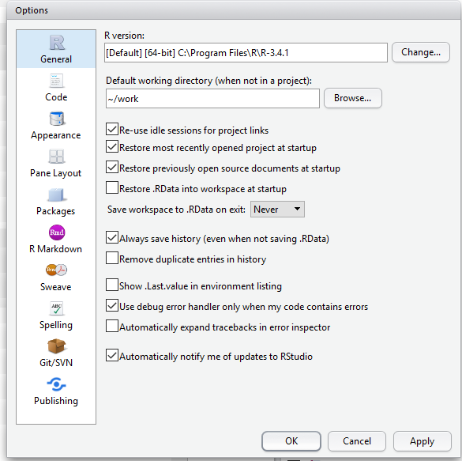
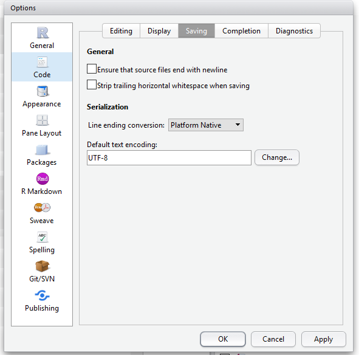
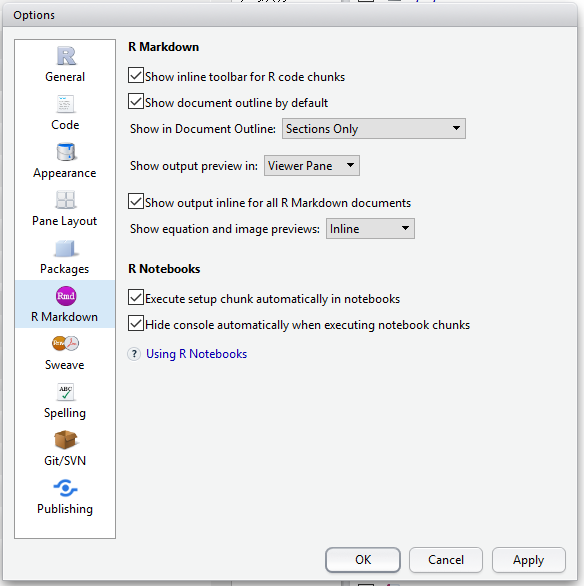
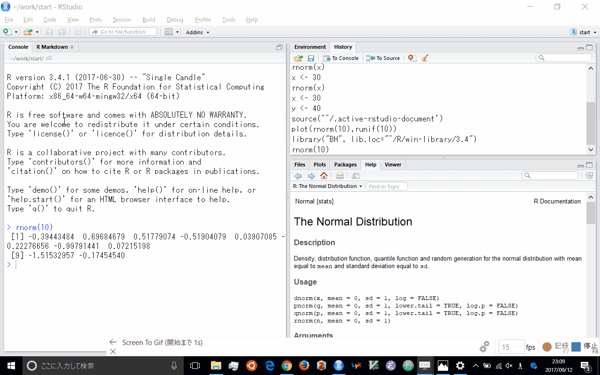
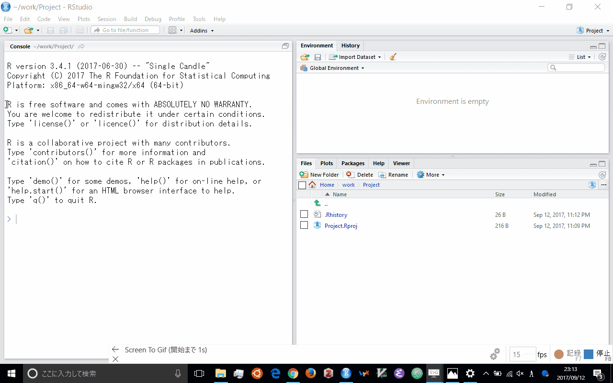
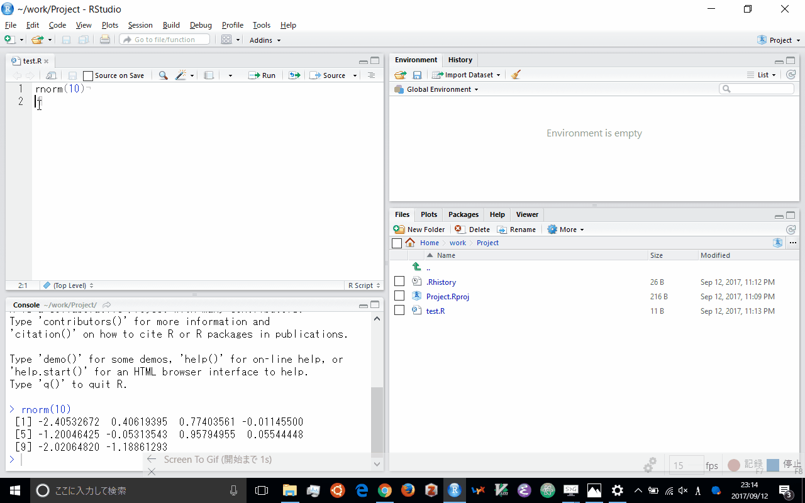
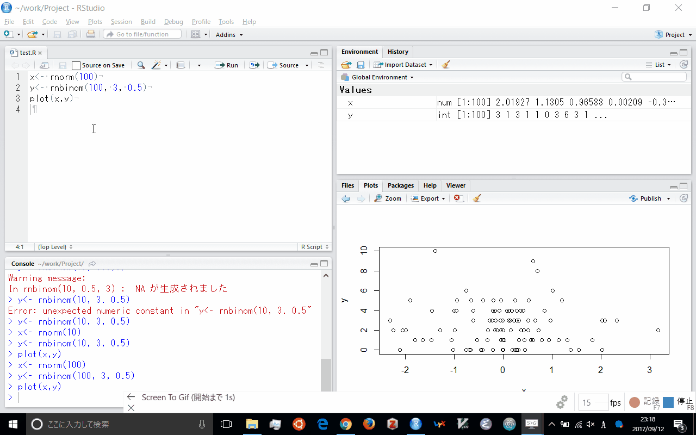

---
output:
  html_document: default
  html_notebook: default
---

# RStudio

## RStudio とは
RStudio は R 向けの統合開発環境 (IDE: Integrated Development Environment) の一つで、現在は Posit 社からオープンソース版と商用版が提供されている。コード編集、実行、デバッグ、可視化を一体的に行える点が大きな特徴である。

デスクトップアプリとして利用するほか、サーバーにインストールしてブラウザ経由で接続する構成も選べるため、個人利用からチーム開発まで幅広い用途に対応できる。

https://posit.co/products/open-source/rstudio/

## RStudio のインストール
RStudio Desktop (オープンソース版) を利用する場合は、まず Posit のダウンロードページにアクセスする。

https://posit.co/download/rstudio-desktop/

使用している OS (Windows、macOS、Linux) に対応したインストーラを取得し、案内に従ってインストールを進める。事前に R 本体がインストールされているかも確認しておくとよい。

インストール後に RStudio を初回起動すると、既にインストールされている R のバージョンを自動検出する。複数バージョンの R を併用している場合は、「Tools」>「Global Options...」>「General」の `R version` から切り替えられる。

Linux で複数ユーザーが利用する環境やサーバー経由でアクセスしたい場合は、RStudio Server (現 Posit Workbench のオープンソース版) を導入する選択肢もある。

なお、RStudio Desktop の使用は無料だが、商用サポートや拡張機能が必要な場合は Posit Workbench などの有償版を検討する。

https://posit.co/download/rstudio-server/

## RStudio の設定
メニューバーの「Tools」>「Global Options...」から、RStudio の振る舞いを細かく調整できる。

まず「General」タブでは、次の 2 つを推奨設定としている。

- `Restore .RData into workspace at startup` のチェックを外す  
- `Save workspace to .RData on exit` を `Never` にする

起動時に前回のオブジェクトが自動復元されるのを防ぎ、終了時にワークスペース保存の確認が出ないようにすることで、常にクリーンな環境から作業を始められる。

<!-- -->

次に「Code」>「Saving」タブで `Default text encoding` を `UTF-8` に設定する。
macOS や Linux では標準で UTF-8 が使われるが、Windows では既定が CP932 (Shift_JIS の拡張) になっているため注意が必要である。

Windows 版 R 自体は内部的に CP932 を扱うものの、異なる OS との共同作業や HTML など他形式への出力を考えると、UTF-8 に統一しておく方が無難である。既存の日本語 R スクリプトの多くは CP932 で公開されているため、必要に応じて一時的にエンコーディングを切り替えるとよい。

<!-- -->

さらに「R Markdown」タブの中央付近にある `Show output preview in:` を `View Pane` に変更しておくと、HTML 出力を RStudio 内のビューアで確認できる。

<!-- -->

## RStudio の使い方
操作方法を手早く把握したい場合は、日本語訳されたチートシートが便利である。

https://raw.githubusercontent.com/rstudio/cheatsheets/main/translations/japanese/rstudio-ide_ja.pdf

英語ではあるが、Posit が公開している動画教材も参考になる。以下のコースでは IDE の基本操作を順を追って学べる（第 1 章は無料で視聴可能）。

https://www.datacamp.com/courses/working-with-the-rstudio-ide-part-1

コースの視聴には DataCamp のアカウントが必要で、アクセス時にログインやブラウザ検証を求められる場合がある。

RStudio ではプロジェクト単位で複数のソースコードやデータを管理するのが推奨される。
プロジェクトごとに作業ディレクトリが切り替わるため、ファイルの読み書きが明確になり、環境を分けて作業できる。

新しいプロジェクトを作成するには、メニューバーの「File」>「New Project」を選ぶ。
既存ディレクトリを指定することも、新しいディレクトリを用意することも可能で、Git などのバージョン管理リポジトリから取得するオプションも用意されている。

<!-- -->

プロジェクトを開くと、左側にコンソールペイン (Console Pane)、右側に上下 2 分割のペインが表示される。
レイアウトはメニューバーの「Tools」>「Global Options」>「Pane Layout」から自由に変更可能である。
コンソールにコマンドを入力すると結果が直ちに表示され、`Ctrl + L` (macOS は `Cmd + L`) で画面をクリアできる。
上下方向の矢印キーを押すと、過去に実行したコマンド履歴を呼び出せる。

新しいスクリプトファイルを作成する場合は、メニューバーの「File」>「New File」>「R Script」を選択するか、`Ctrl + Shift + N` (macOS は `Cmd + Shift + N`) を押す。
ツールバー左端の白紙アイコンをクリックしても同じ操作が実行される。
スクリプトを開くと、コンソールの上部にソースペインが表示され、ここでコードを編集する。

ソースペインで編集中の行を実行するには、その行で `Ctrl + Enter` (macOS は `Cmd + Return`) を押すか、ツールバーにある「Run」ボタンをクリックする。
複数行を選択した状態でメニューバーの「Code」>「Run Selected Line(s)」を選ぶ、あるいは `Ctrl + Shift + Enter` (macOS は `Cmd + Shift + Enter`) を押すと、選択した範囲をまとめて実行できる。

チャンク単位でコードを試したい場合は、`source` パネルの右上にある `Source` メニューから `Source selected text` や `Source with Echo` を選ぶと、ファイル全体または選択範囲をまとめて実行しつつ結果を確認できる。

スクリプトを保存するには、メニューバーの「File」>「Save」を選択するか、`Ctrl + S` (macOS は `Cmd + S`) を押す。
ツールバー左から 3 番目のフロッピーディスクアイコンでも保存できる。
既存ファイルを開くときは「File」>「Open...」、`Ctrl + O` (macOS は `Cmd + O`)、もしくはツールバー左から 2 番目のフォルダアイコンを利用する。

<!-- -->

右上のペインには「Environment」と「History」タブが並ぶ。
Environment には現在メモリ上に存在するオブジェクトが一覧表示され、変数に値を代入するとここに反映される。
History にはこれまで実行したコマンドが時系列で記録され、必要なものをソースペインやコンソールに再挿入できる。

右下のペインには「Files」「Plots」「Packages」「Help」「Viewer」の各タブがある。
Files タブは Explorer や Finder のように、プロジェクト配下のファイルを管理できる。
新しいフォルダの作成、ファイルの削除や名称変更などが可能で、目的のフォルダを開いた状態で「More」>「Set As Working Directory」を選ぶと作業ディレクトリをその場所に設定できる。

Plots タブは作成したグラフのプレビューが表示され、画像ファイルとして保存する操作もここから行える。
Packages タブにはインストール済みパッケージの一覧が表示され、チェックボックスをオンにすると `library()` を呼び出さずにパッケージを読み込める。
未導入のパッケージはメニューバーの「Tools」>「Install Packages...」から追加する。

Help タブには各種ヘルプドキュメントが表示される。
コンソールで `help(関数名)` や `?関数名` と入力すると、このタブに該当関数の説明が開く。
ソースペインやコンソールでコマンドを入力中に `Tab` キーを押すと補完候補が表示され、再度 `Tab` を押すと引数候補と簡易説明が確認できる。
その状態で `F1` キーを押すと、詳しいヘルプが表示される。
Packages タブでパッケージ名をクリックした場合も、そのパッケージに含まれる関数一覧が Help タブに展開される。

<!-- -->

Viewer ペインは、R Markdown で作成した HTML 出力や Shiny アプリのプレビューなどを表示する。
既定では外部ブラウザが開く設定になっているが、前述の `Show output preview in: View Pane` を有効にすると、RStudio 内のペインで結果を確認できる。

R Markdown 文書を Knit するには、ソースペインで `Ctrl + Shift + K` (macOS は `Cmd + Shift + K`) を押すか、ツールバー右端のニット (ニット帽子) アイコンをクリックする。
ダイアログで `HTML` を選択すると、コードが順に実行され、結果とグラフを含む HTML ファイルが生成される。
メニューバーの「File」>「Knit Document...」から操作することも可能である。

Shiny アプリや Quarto ドキュメントなど、R Markdown 以外の出力も Viewer ペインで実行・プレビューできる。表示が崩れる場合は、ペイン右上の歯車アイコンからブラウザ表示に切り替えて確認する。

<!-- -->

この機能は `knitr` と `rmarkdown` パッケージを利用しており、R コードを埋め込んだ Markdown (`.Rmd`) ファイルから HTML をはじめ、適切な設定を行えば Word や PDF などにも出力できる。
新しい R Markdown 文書を作成するには、「File」>「New File」から「R Notebook」または「R Markdown」を選択する。
