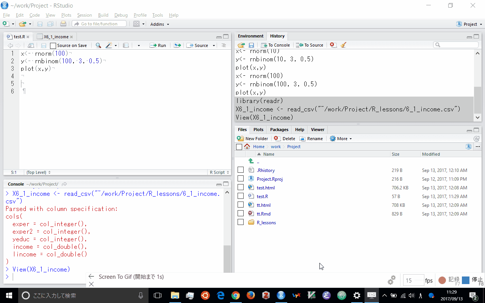
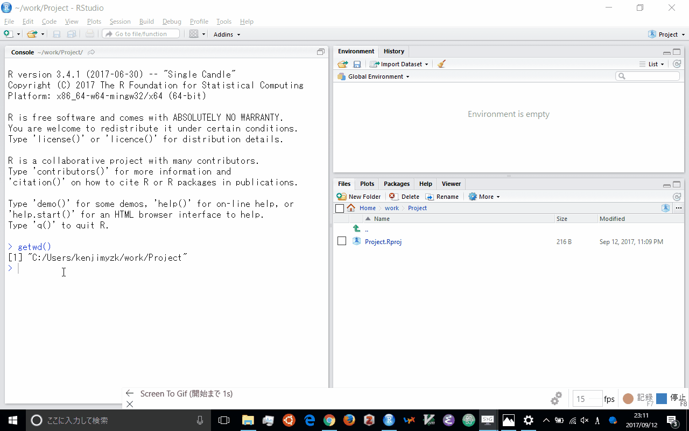

# データ入力
```{r setup, include=FALSE}
knitr::opts_chunk$set(echo = TRUE, collapse=TRUE)
```

```{r, message=FALSE, warning=FALSE}
library(tidyverse)
```

## はじめに
R においてデータ分析をおこなうには
データ入力する必要がある.
データについてがR やパッケージに入っている場合があるが,
多くは外部ファイルを取り込むことになる.
読み込まれたデータはRではデータフレイム (dataframe) となる.

データフレイムは同じ長さのベクトルを組み合わせたリストのことである.
たてばデータフレイムは次のようにして作られる.
```{r}
df <- data.frame(x = rnorm(10), y = letters[1:10])
```

ただデータフレイムは自動的に文字列が因子ベクトルに変換されてしまう.
これを避けるには次のように `stringsAsFactors= FALSE` をつける.
```{r}
df <- data.frame(x = rnorm(10), y = letters[1:10], stringsAsFactors= FALSE)
str(df)
```

もしくはライブラリ `dplyr` にある `data_frame` を用いれば, そのようなオプションを付けることなくデータフレイムを拡張したクラスを作ることができる.
```{r}
library(dplyr)
df <- data_frame(x = rnorm(10), y = letters[1:10])
str(df)
```

外部ファイルから入力するさいには
```{r, eval=FALSE}
getwd()
```
で現在のワークングディレクトリとファイルが一致しているかどうかを確認しなければならない.
もし一致していないのなら `setwd` で変更する必要がある.

また `RStudio` はメニューバーの `File` から `Import Dataset` からインタラクティブに外部ファイルが入力可能である.
いったんこれで入力したとしても, history ペインでどのようなコマンドを実行したかを確認して, 次回も実行できるよう記録しておくとよい.

```{r, echo=FALSE}

```

## csv ファイル

csv ファイルの csv とは comma separated variable の略で,
その名の通りコンマでわけられた変数が以下のようなテキストファイルである.
```
var1, var2, var3
3, 4,"text"
4, 4, "text"
...
```
最初の一行は変数名を含まれていることが多いけれど, ない場合もあり事前に確認が必要である.
R 以外の計算機で作成した結果を csv で保存しておけば, それを R に取り込むことができる.

csv ファイルをRに取り込むには関数 `raed.table` を使うのが基本である.
```{r, eval=FALSE}
df <- read.table("data.csv", header=TRUE, sep = ",")
```
こうすればオブジェクト `df` にデータフレイムとして導入される.

関数 `read.csv` を使えば, 以上のオプションを付ける必要がない.
```{r, eval=FALSE}
df <- read.table("data.csv")
```

外部からファイルを取り込んだ場合, 文字列は自動的に因子ベクトルに変換されてしまう.
これを避けるには次のようにオプションをつける必要がある.
```{r, eval=FALSE}
df <- read.table("data.csv", stringsAsFactors= FALSE)
```

ファイルを書き込むときには次のようにする. 
```{r, eval=FALSE}
write.csv(df,"data.csv", row.names = FALSE)
```
このオプションはファイルの一列目に `rownames` が書き込まれるのを避けるための設定である.

もしくはライブラリ `readr` を導入する.
ファイルの読み込みは以下となる.
```{r, eval=FALSE}
library(readr)
df <- read_csv("data.csv")
```
特にオプションをつけなくても, 文字列は自動的に因子ベクトルに変換されない.

ファイルの書き込みは以下となる.
```{r, eval=FALSE}
write_csv(df,"data.csv")
```
特にオプションをつけなくても, `rownames` は書き込まない.

## EXCEL ファイル
EXCELはビジネスにおいてデファクトスタンダードになっているスプレッドシートソフトウェアである.
R は EXCEL のデータを扱うことができる.

最近のEXCELデータの拡張子は `xlsx` である.
これを導入するにはライブラリ `readxl` を使えばよい.
```{r, eval=FALSE}
library(readxl)
df <- read_excel("data.xlsx",1)
```
ファイル`data.xls` の一枚目のシートを意味する.

直接シート名を指定することができる.
```{r, eval=FALSE}
read_excel("data.xlsx","Revenues")
```
こちらは「Revenues」という名前のシートを意味する.

EXCELから入力するときには, 一行目を変数名にして,
列ごとに変数を揃えておかなければならない.
最終行に合計などがあれば, それも変数として入力してしまうので, 注意が必要である.


またEXCELからcsvファイルに変換して, ファイルを読み込ませる方法がある.
これは2点ほど注意が必要である.
まず EXCEL で桁をしめすコンマのまま保存すると文字列として保存されてしまう.
そうしたファイルを `read.csv` で読み込む数値でなく⽂字列として読み込まれてしまう .
それを避けるには , 桁を示すコンマを無しに直して保存しなければならない. 
なお read_csv をもちいるなら数値として読み込んでくれる 

また変数名をアルファベットのみにしておいたほうがトラブルが少ない . 
日本語が含まれている場合に , EXCEL 上 で csv 形式に変換して保存したときにシフト JIS で保存されてしまう . 
Linux や Mac では文字コードをUTF-8 にしているので
そのままの読み込みだと⽇本語が⽂字化けになる . 
Windows でも RStudio を導入したときに最初に文字コードを UTF-8 に設定していたのなら同じように文字化けになる.
それを防ぐためには , `read.csv` を用いるときは
```{r, eval=FALSE}
df <- read.csv("data.csv", stringAsFactors=FALSE, fileEncoding="SJIS")
```
として, `read_csv` を用いるときは
```{r, eval=FALSE}
df <- read_csv("data.csv", locale=locale(encoding = "SJIS"))
```
とする必要がある.

私の使った印象だとライブラリ `readxl` は賢く日本語を扱ってくれっるので,
日本語が含まれている場合, csv に変換せず, そのまま入力したほうがよい.

## STATA
Stata は多くの経済学者が実証分析に用いている統計パッケージである.
R は Stata のデータを扱うことができる.

Stata のデータは拡張子 `dta` で保存されている.
これを導入するにはライブラリ `foreign` を用いる.
```{r, eval=FALSE}
library(foreign)
df <- read.dta("data.dta")
```

ただ, 最新のstataには対応していない.
最新のstataに対応するにはライブラリ `haven` を導入する.
```{r, eval=FALSE}
library(haven)
df <- read_dta("data.dta")
```

他にも `SAS` や `SPSS` などの統計パッケージのデータも取り込むことができる.

## R に入っているデータ
R およびパッケージにはいくつかのデータがはいっている.
どのようなデータが利用可能課は以下のコマンドで調べくことができる.
```{r, eval=FALSE}
data()
```

それがどのような変数が含まれているのかを調べるには, `help` を使えばよい.
```{r, eval=FALSE}
help(cars)
```

```{r, echo=FALSE}

```

パッケージのデータは関数 `data` をつかって利用可能になる.
```{r}
library(AER)
data(CPS1985)
summary(CPS1985)
```


## インターネットからデータ入力
またWebスクレイピングをしてインターネットのサイトから直接入手できる.
幾つかのデータベースでは api が公開されて,
それにもとづいてパッケージが作成されている.

+ yahoo finance (quantmod)
+ yahoo finance Japan (RFinanceYJ)
+ World Development Indicators (WDI)
+ Eurostat (eurostat)
+ e-stat (estatap)

また直接, インターネットのファイルをダウンロードすることもできる.
```{r, eval=FALSE}
library(haven)
URL <- "http://fmwww.bc.edu/ec-p/data/wooldridge/attend.dta"
df <-read_dta(URL)
```

もし一旦ファイルとして保存しておくなら以下のように実施する.
```{r, eval=FALSE}
if(!file.exists("mroz.dta")) download.file(URL, "mroz.dta",method="curl")
library(haven)
df <- read_dta("mroz.dta")
```

## その他のデータ入力
Rのバイナルファイルとして保存していれば, それを読み込むことができる.
ただ私はほとんど利用したことがない.

他にもリレーショナルデータベースにアクセスして, データを入手できる.
これも私はほとんど利用したことがない.


