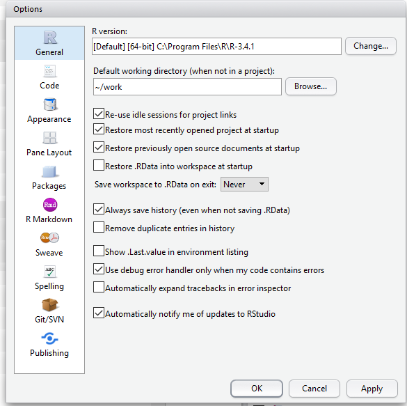
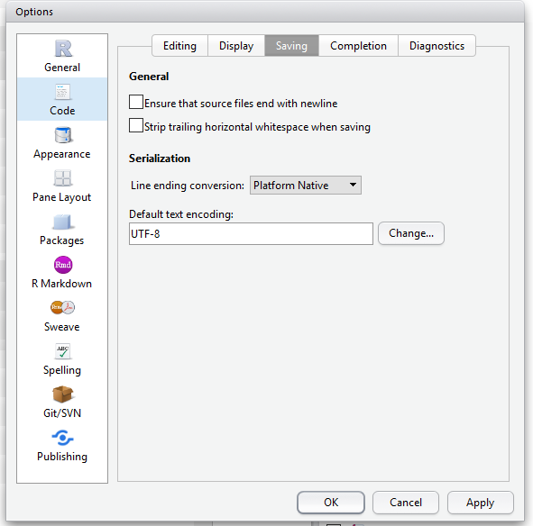
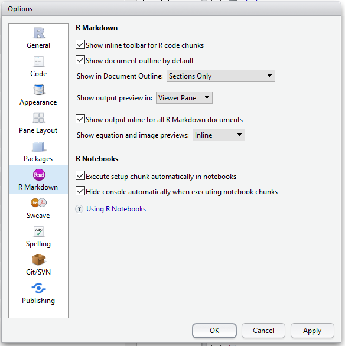
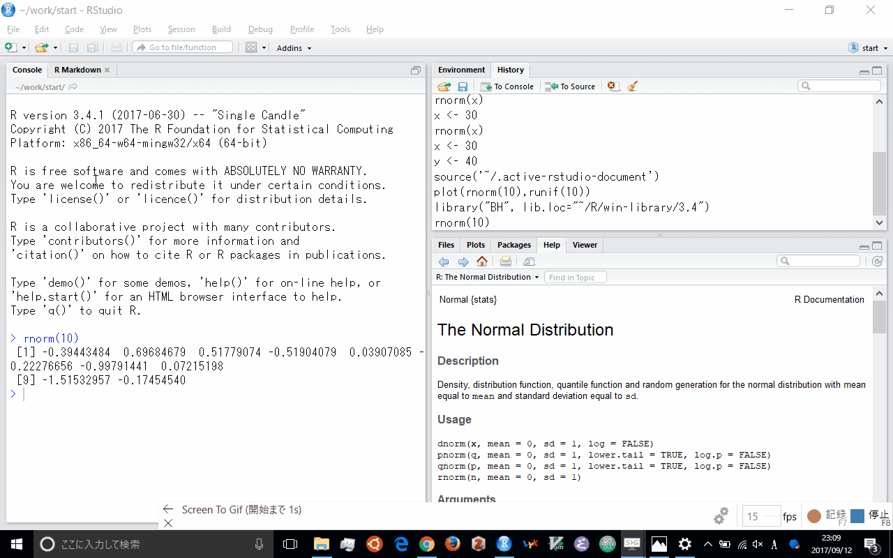
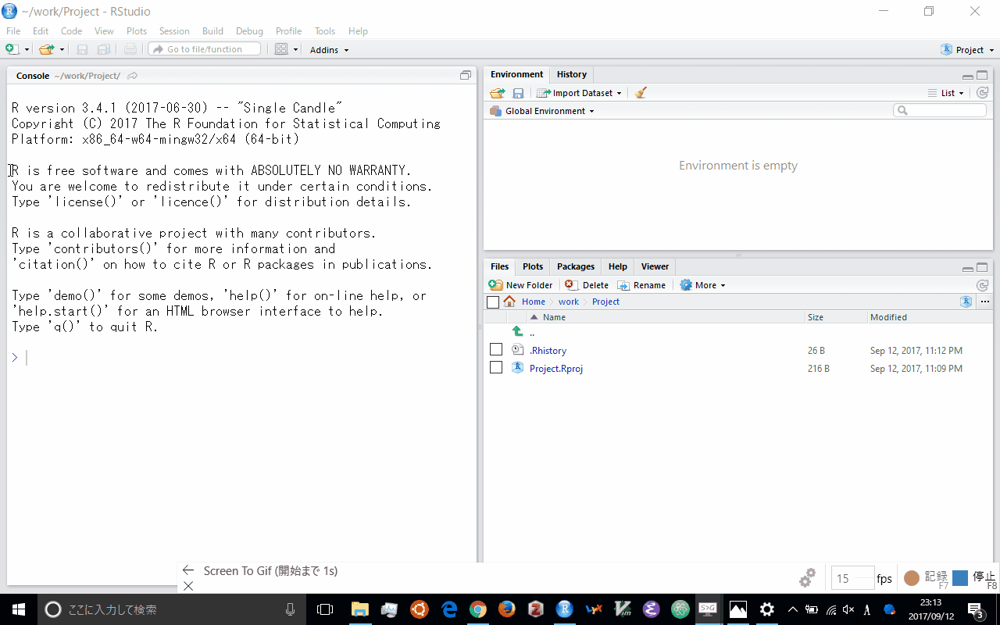
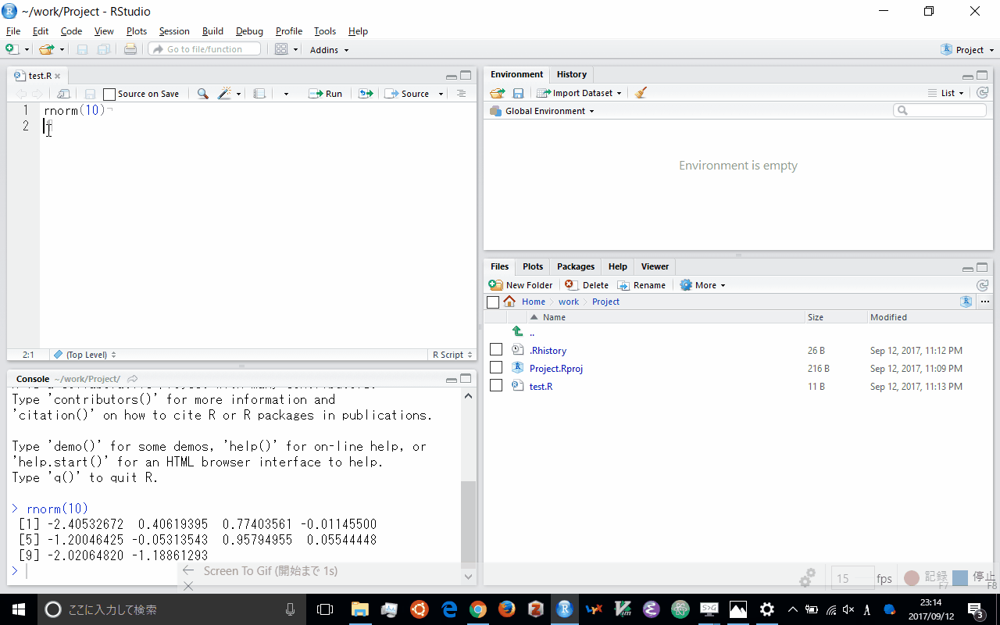
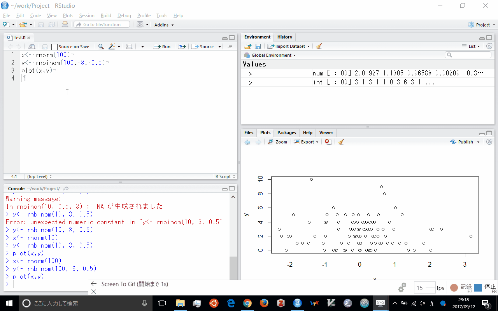

---
output:
  html_document: default
  html_notebook: default
---

# RStudio

## RStudio とは
RStudio とは R の統合開発環境 (IDE, Integrated Development Enviroment) である.
オープンソース版が存在する.

https://ja.wikipedia.org/wiki/R-Studio

## RStudio のインストール
オープンソース版のRStudio のインストールは

https://www.rstudio.com/products/rstudio/download/

にいき, 該当機種のファイルをダウンロードする.
ダウンロードしたあとに実行すればインストールされる.

Ubuntu ならサーバー版を導入するとよい.

https://www.rstudio.com/products/rstudio/download-server/

## RStudio の設定
メニューバーの [Tools] から [Global Options...] を選択することで設定を変更できる.

[General] で以下のように
[Restore .RData ...] のチェックを外していいて,
その下を `Never` にしている. 
これは, 立ち上げたきに環境をクリーンし,
終了時に, データの保存を聞かれないようにするためである.

次に, [Code] の タブ [Saving] で. 
[Default text encoding] を `UTF-8` としている.
Windows 以外だとOSのシステムフォントが同じなので問題ない.
ただ, Windows は SJIS を拡張した CP932 なので, 注意が必要である.

Windows のRは UTF-8 を選択してもR自身はCP932処理している.
ただ, 他のOSとの併用の場合, UTF-8 にしたほうがよいだろう.
またHTMLファイルは UTF-8 でのファイルが前提になりつつあるので,
HTML として出力を考えているなら, `UTF-8` としたほうが無難である.

またインターネットで公開されている日本語のRファイルは
Windows の使用が前提となっているため, 文字コードが CP932 であることが多い. Windows 以外を使っている場合, 一時的に文字コードを SJIS を選択する必要がある.

あと, [R Markdown] で 真ん中あたりの [Show output preview in:] を `View Pane` に変更する

## RStudio の使い方
RStudio の使い方として日本語版のチートシートがある.

https://github.com/rstudio/cheatsheets/raw/master/translations/japanese/rstudio-IDE-cheatsheet_ja.pdf

RStudio プロジェクト単位で複数のソースコードを管理するのことが推奨される.
そうするとプロジェクトごとに作業ディレクトリが設定される.
プロジェクトはメニューバー の [File] から [New Project] を選択する.
そうすると新たに新たにディレクトリを作成するか, 既存のディレクトリを採用するかなどが選べる.
また, バージョン管理ソフトを導入していればそこから取り入れることも可能となる.

<!-- -->

プロジェクトを立ち上げると左にコンソールペイン (Console Pane) が, 右側に上下に二分割されたペインが現れる.
この配置は メニューバーの [Tools] から [Project Options -> Pane Layout] を選べば変更可能である.
コンソールペインにコマンドを入力するとその結果が直下に返される.
何か入力した後に, Ctrl + l (Cmd + l) を押すと, 画面が更新される.
上下の矢印キーで過去に実行したコマンドを選択できる.

メニューバー の [File] から [New File -> RScript] を選択するか,
Ctrl + Shift + n (Cmd + Shift + n) と入力するか, メニューバー下の一番左の白紙のアイコンをクリックすると,
Rのスクリプトファイルが新規に作られる. 
スクリプフォファイルを開くと左側のコンソール画面の上にソースペインが登場する. 
ここにソースコードを書く.

ソースペインで何かコマンドを書いていきながら,
ソースコードの該当行で Ctrl + Enter (Cmd + Return) と入力するか, ソースペインの上側の右に並んでいるアイコンのうち, 左側のRunと書かれたアイコンをクリックすると, 該当行がコンソール画面で実行される.
複数行選択した後に, メニューバー の [Code] から [Run Selected line(s)] を選ぶか,
Ctrl + Shift + Enter  (Cmd + Shift + Enter) と入力すると複数行をまとめて実行させることも可能である.

メニューバー の [File] から [Save] を選択するか, Ctrl + s (Cmd + s) と入力するか, メニューバー下の左から3番目のフロッピーディスクアイコンをクリック
すると, スクリプトファイルを保存することができる.
またメニューバー の [File] から [Open] を選択するか,
Ctrl + o (Cmd + o) と入力するか, メニューバー下の左から2番めのフォルダを開くアイコンをクリックすると, 
既存のスクリプトファイルを開くことができる.

<!-- -->

右上のペインには Environment と History のタブがある.
Environment は現在使っているオブジェクトが表示される.
最初は空白である. 
変数に数値を代入 (R の言い方ではオブジェクトに付値) することによって,
値が付け加わっている.
History はこれまでの履歴が記録される.
履歴の一部ををエディトペインかコンソールペインに挿入することができる.

右下のペインには Files, Plots, Packages, Help, Viewer のタブがある.
Files ペインはWindowsではエクスプローラーのようなもので,
Mac はFinder のようなもので, ファイル管理をおこなう.
ファイル管理として新たなフォルダを作成したり, ファイルを削除したり,
ファイル名を変更したりする.

Plots ペインはコンソール画面で作図をコマンドの実行したら, 表示されるペインである. そこで作成した図をコマンドを使わずに保存したりすることができる.
Packages ペインは現在Rに導入されているパッケージリストが表示される.
そこに無いパッケージはメニューバーの [Tools] から [Install Packages...] を選択して実行すればよい.
すでにあるパッケージは, パッケージ名の左側のボックスをチェックすれば,
ライブライリ名を付けずにコマンドを実行させることができる.

Help ペインはその名の通り, ヘルプ画面が表示される. 
コンソールペインから `help (コマンド)` もしくは `?コマンド` と入力するとそのコマンドのヘルプがこのペインに表示される.
R ではソースペインやコンソールペインで, コマンド入力していると, コマンドの後補があらわてくる. [TAB] でコマンドを補完できる.
さらにそのコマンドでどのような引数が使われるのかも示される.
さらに [TAB] を押せば, 引数を選べるだけでなく, 簡単なコマンドの説明がある.
そのときに [F1] を押せば, より詳細なヘルプが立ち上がる.
また Packages パインから該当パッケージをクリックするとそのパッケージのコマンド一覧が Help ペインに表示される.

<!-- -->

最後のViewer ペインは R Markdown で作成したファイルを HTMLで出力したときに表示されるペインである.
最初の設定だと別のウィンドウ画面として結果が表示される.
このペインに出力されるためには [Tools -> R Markdown] にいき, 真ん中あたりの
[Show output preview in:] を View Pane に変更する必要がある. 
その上でソースペインから [Ctrl + Shift + k] とするか, ソースペインの左側のアイコン群の一番右側のノートのアイコンをクリックすると,
確認画面が現れるので `HTML` を押す. 
そうするとそのコードがすべて実行されて, 実行結果が作図も含めてHTMLファイルに出力される.
もしくはメニューバーの [File] から [Knit Document...] としを選択するとよい.

<!-- -->

これは knitr と rmarkdown いわれるパッケージを利用したもので, Rのコードを埋め込んだマークダウンファイルを作成し,
そこからHTMLファイルを作成する.
他にも word ファイル や pdf ファイル生成することも適切に設定していれば可能である.
ソースコードだけでなく, マークダウンファイルに `R` コマンドを埋め込んだ `Rmd` ファイルを作成することができる
それは新規作成でRスクリプトでなく, R Notebook や R Markdown を選択すればよい.

