# データ分析

```r
library(tidyverse)
library(modelr)
library(mosaic)
```

## 回帰分析
### 単回帰分析
回帰分析は以下のコマンドで実施する.

```r
fm <- lm(dist ~ speed, data= cars)
```

作図すると次のようになる.

```r
cars %>% gf_point(dist ~ speed) %>% gf_lm()
```

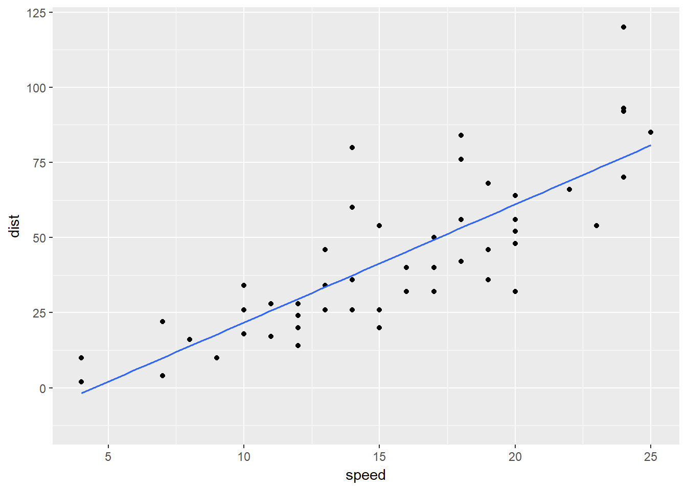

リストが作られる.

```r
typeof(fm)
```

```
## [1] "list"
```

```r
names(fm)
```

```
##  [1] "coefficients"  "residuals"     "effects"       "rank"         
##  [5] "fitted.values" "assign"        "qr"            "df.residual"  
##  [9] "xlevels"       "call"          "terms"         "model"
```

おもな要素は以下である.

```r
fm[["coefficients"]] # fm$coefficients
```

```
## (Intercept)       speed 
##  -17.579095    3.932409
```

```r
fm[["residuals"]]  # fm$residuals
```

```
##          1          2          3          4          5          6 
##   3.849460  11.849460  -5.947766  12.052234   2.119825  -7.812584 
##          7          8          9         10         11         12 
##  -3.744993   4.255007  12.255007  -8.677401   2.322599 -15.609810 
##         13         14         15         16         17         18 
##  -9.609810  -5.609810  -1.609810  -7.542219   0.457781   0.457781 
##         19         20         21         22         23         24 
##  12.457781 -11.474628  -1.474628  22.525372  42.525372 -21.407036 
##         25         26         27         28         29         30 
## -15.407036  12.592964 -13.339445  -5.339445 -17.271854  -9.271854 
##         31         32         33         34         35         36 
##   0.728146 -11.204263   2.795737  22.795737  30.795737 -21.136672 
##         37         38         39         40         41         42 
## -11.136672  10.863328 -29.069080 -13.069080  -9.069080  -5.069080 
##         43         44         45         46         47         48 
##   2.930920  -2.933898 -18.866307  -6.798715  15.201285  16.201285 
##         49         50 
##  43.201285   4.268876
```

```r
fm[["fitted.values"]] # fm$fitted.values
```

```
##         1         2         3         4         5         6         7 
## -1.849460 -1.849460  9.947766  9.947766 13.880175 17.812584 21.744993 
##         8         9        10        11        12        13        14 
## 21.744993 21.744993 25.677401 25.677401 29.609810 29.609810 29.609810 
##        15        16        17        18        19        20        21 
## 29.609810 33.542219 33.542219 33.542219 33.542219 37.474628 37.474628 
##        22        23        24        25        26        27        28 
## 37.474628 37.474628 41.407036 41.407036 41.407036 45.339445 45.339445 
##        29        30        31        32        33        34        35 
## 49.271854 49.271854 49.271854 53.204263 53.204263 53.204263 53.204263 
##        36        37        38        39        40        41        42 
## 57.136672 57.136672 57.136672 61.069080 61.069080 61.069080 61.069080 
##        43        44        45        46        47        48        49 
## 61.069080 68.933898 72.866307 76.798715 76.798715 76.798715 76.798715 
##        50 
## 80.731124
```

これらは以下の関数でも計算できる.

```r
coef(fm)
```

```
## (Intercept)       speed 
##  -17.579095    3.932409
```

```r
resid(fm)
```

```
##          1          2          3          4          5          6 
##   3.849460  11.849460  -5.947766  12.052234   2.119825  -7.812584 
##          7          8          9         10         11         12 
##  -3.744993   4.255007  12.255007  -8.677401   2.322599 -15.609810 
##         13         14         15         16         17         18 
##  -9.609810  -5.609810  -1.609810  -7.542219   0.457781   0.457781 
##         19         20         21         22         23         24 
##  12.457781 -11.474628  -1.474628  22.525372  42.525372 -21.407036 
##         25         26         27         28         29         30 
## -15.407036  12.592964 -13.339445  -5.339445 -17.271854  -9.271854 
##         31         32         33         34         35         36 
##   0.728146 -11.204263   2.795737  22.795737  30.795737 -21.136672 
##         37         38         39         40         41         42 
## -11.136672  10.863328 -29.069080 -13.069080  -9.069080  -5.069080 
##         43         44         45         46         47         48 
##   2.930920  -2.933898 -18.866307  -6.798715  15.201285  16.201285 
##         49         50 
##  43.201285   4.268876
```

```r
fitted(fm) #predict(fm)
```

```
##         1         2         3         4         5         6         7 
## -1.849460 -1.849460  9.947766  9.947766 13.880175 17.812584 21.744993 
##         8         9        10        11        12        13        14 
## 21.744993 21.744993 25.677401 25.677401 29.609810 29.609810 29.609810 
##        15        16        17        18        19        20        21 
## 29.609810 33.542219 33.542219 33.542219 33.542219 37.474628 37.474628 
##        22        23        24        25        26        27        28 
## 37.474628 37.474628 41.407036 41.407036 41.407036 45.339445 45.339445 
##        29        30        31        32        33        34        35 
## 49.271854 49.271854 49.271854 53.204263 53.204263 53.204263 53.204263 
##        36        37        38        39        40        41        42 
## 57.136672 57.136672 57.136672 61.069080 61.069080 61.069080 61.069080 
##        43        44        45        46        47        48        49 
## 61.069080 68.933898 72.866307 76.798715 76.798715 76.798715 76.798715 
##        50 
## 80.731124
```


計算結果は `summary()` で表記される.

```r
summary(fm)
```

```
## 
## Call:
## lm(formula = dist ~ speed, data = cars)
## 
## Residuals:
##     Min      1Q  Median      3Q     Max 
## -29.069  -9.525  -2.272   9.215  43.201 
## 
## Coefficients:
##             Estimate Std. Error t value Pr(>|t|)    
## (Intercept) -17.5791     6.7584  -2.601   0.0123 *  
## speed         3.9324     0.4155   9.464 1.49e-12 ***
## ---
## Signif. codes:  0 '***' 0.001 '**' 0.01 '*' 0.05 '.' 0.1 ' ' 1
## 
## Residual standard error: 15.38 on 48 degrees of freedom
## Multiple R-squared:  0.6511,	Adjusted R-squared:  0.6438 
## F-statistic: 89.57 on 1 and 48 DF,  p-value: 1.49e-12
```

これもリスト型であり, 以下の要素をもつ.

```r
typeof(summary(fm))
```

```
## [1] "list"
```

```r
names(summary(fm))
```

```
##  [1] "call"          "terms"         "residuals"     "coefficients" 
##  [5] "aliased"       "sigma"         "df"            "r.squared"    
##  [9] "adj.r.squared" "fstatistic"    "cov.unscaled"
```

おもな要素は以下である.

```r
summary(fm)[["coefficients"]]
```

```
##               Estimate Std. Error   t value     Pr(>|t|)
## (Intercept) -17.579095  6.7584402 -2.601058 1.231882e-02
## speed         3.932409  0.4155128  9.463990 1.489836e-12
```

```r
summary(fm)[["sigma"]]
```

```
## [1] 15.37959
```

```r
summary(fm)[["r.squared"]]
```

```
## [1] 0.6510794
```

```r
summary(fm)[["adj.r.squared"]]
```

```
## [1] 0.6438102
```

```r
summary(fm)[["cov.unscaled"]]
```

```
##             (Intercept)        speed
## (Intercept)  0.19310949 -0.011240876
## speed       -0.01124088  0.000729927
```

次のように計算してもよい. 

```r
coef(summary(fm))
```

```
##               Estimate Std. Error   t value     Pr(>|t|)
## (Intercept) -17.579095  6.7584402 -2.601058 1.231882e-02
## speed         3.932409  0.4155128  9.463990 1.489836e-12
```

```r
sigma(fm)
```

```
## [1] 15.37959
```

```r
vcov(fm)
```

```
##             (Intercept)      speed
## (Intercept)   45.676514 -2.6588234
## speed         -2.658823  0.1726509
```

### 重回帰分析
複数の変数は `+` 付け足すことができる.

```r
fm<-lm(mpg ~ disp + wt, data =mtcars)
summary(fm)
```

```
## 
## Call:
## lm(formula = mpg ~ disp + wt, data = mtcars)
## 
## Residuals:
##     Min      1Q  Median      3Q     Max 
## -3.4087 -2.3243 -0.7683  1.7721  6.3484 
## 
## Coefficients:
##             Estimate Std. Error t value Pr(>|t|)    
## (Intercept) 34.96055    2.16454  16.151 4.91e-16 ***
## disp        -0.01773    0.00919  -1.929  0.06362 .  
## wt          -3.35082    1.16413  -2.878  0.00743 ** 
## ---
## Signif. codes:  0 '***' 0.001 '**' 0.01 '*' 0.05 '.' 0.1 ' ' 1
## 
## Residual standard error: 2.917 on 29 degrees of freedom
## Multiple R-squared:  0.7809,	Adjusted R-squared:  0.7658 
## F-statistic: 51.69 on 2 and 29 DF,  p-value: 2.744e-10
```


```r
data("CPS1985", package="AER")
summary(CPS1985)
```

```
##       wage          education       experience         age       
##  Min.   : 1.000   Min.   : 2.00   Min.   : 0.00   Min.   :18.00  
##  1st Qu.: 5.250   1st Qu.:12.00   1st Qu.: 8.00   1st Qu.:28.00  
##  Median : 7.780   Median :12.00   Median :15.00   Median :35.00  
##  Mean   : 9.024   Mean   :13.02   Mean   :17.82   Mean   :36.83  
##  3rd Qu.:11.250   3rd Qu.:15.00   3rd Qu.:26.00   3rd Qu.:44.00  
##  Max.   :44.500   Max.   :18.00   Max.   :55.00   Max.   :64.00  
##     ethnicity     region       gender         occupation 
##  cauc    :440   south:156   male  :289   worker    :156  
##  hispanic: 27   other:378   female:245   technical :105  
##  other   : 67                            services  : 83  
##                                          office    : 97  
##                                          sales     : 38  
##                                          management: 55  
##            sector    union     married  
##  manufacturing: 99   no :438   no :184  
##  construction : 24   yes: 96   yes:350  
##  other        :411                      
##                                         
##                                         
## 
```

```r
fm1 <- lm(wage ~ experience + education, data=CPS1985)
summary(fm1)
```

```
## 
## Call:
## lm(formula = wage ~ experience + education, data = CPS1985)
## 
## Residuals:
##    Min     1Q Median     3Q    Max 
## -8.351 -2.857 -0.599  1.994 36.336 
## 
## Coefficients:
##             Estimate Std. Error t value Pr(>|t|)    
## (Intercept)  -4.9045     1.2189  -4.024 6.56e-05 ***
## experience    0.1051     0.0172   6.113 1.89e-09 ***
## education     0.9260     0.0814  11.375  < 2e-16 ***
## ---
## Signif. codes:  0 '***' 0.001 '**' 0.01 '*' 0.05 '.' 0.1 ' ' 1
## 
## Residual standard error: 4.599 on 531 degrees of freedom
## Multiple R-squared:  0.202,	Adjusted R-squared:  0.199 
## F-statistic: 67.22 on 2 and 531 DF,  p-value: < 2.2e-16
```


## 非線形モデル
### 対数モデル
被説明変数が対数をとるときの回帰分析は以下を実行する.

```r
fm_1 <-lm(log(dist) ~ speed, data=cars)
summary(fm_1)
```

```
## 
## Call:
## lm(formula = log(dist) ~ speed, data = cars)
## 
## Residuals:
##      Min       1Q   Median       3Q      Max 
## -1.46604 -0.20800 -0.01683  0.24080  1.01519 
## 
## Coefficients:
##             Estimate Std. Error t value Pr(>|t|)    
## (Intercept)  1.67612    0.19614   8.546 3.34e-11 ***
## speed        0.12077    0.01206  10.015 2.41e-13 ***
## ---
## Signif. codes:  0 '***' 0.001 '**' 0.01 '*' 0.05 '.' 0.1 ' ' 1
## 
## Residual standard error: 0.4463 on 48 degrees of freedom
## Multiple R-squared:  0.6763,	Adjusted R-squared:  0.6696 
## F-statistic: 100.3 on 1 and 48 DF,  p-value: 2.413e-13
```


```r
cars %>% gf_point(log(dist) ~ speed) %>% gf_lm()
```

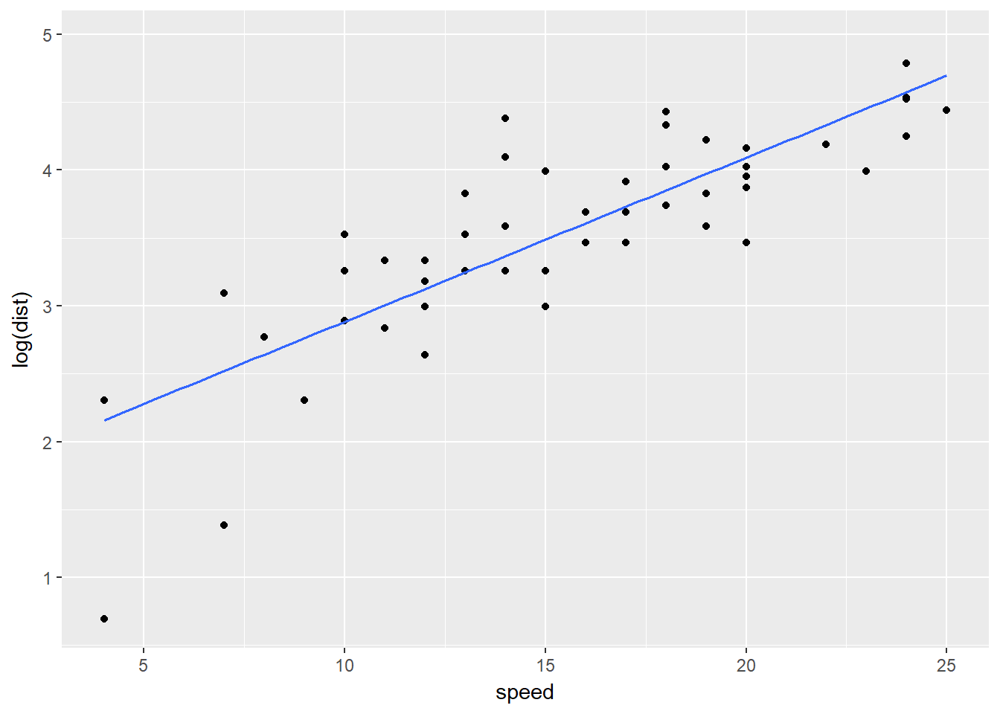


```r
fn1 <- makeFun(fm_1)
cars %>% gf_point(log(dist) ~ speed) %>% gf_fun(log(fn1(speed))~speed)
```

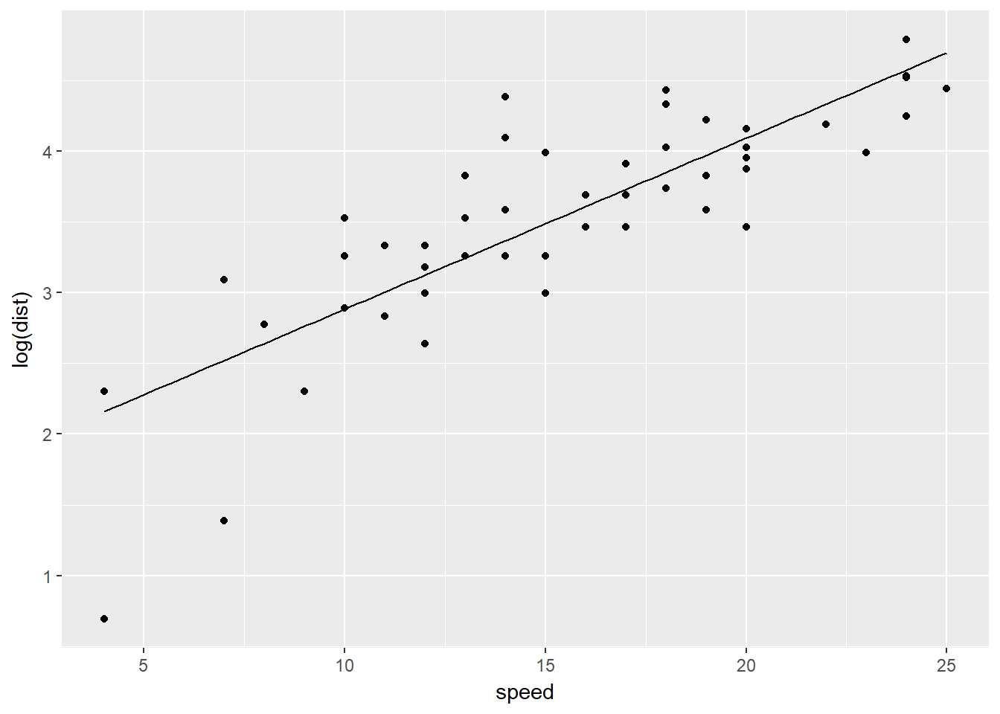


```r
cars %>% gf_point(dist ~ speed) %>% gf_fun(fn1(speed)~speed)
```


```r
grid <- cars %>% data_grid(speed=seq_range(speed,15)) %>%
  add_predictions(fm_1)
cars %>% gf_point(dist ~ speed) %>%
  gf_line(data=grid, exp(pred)~speed)
```

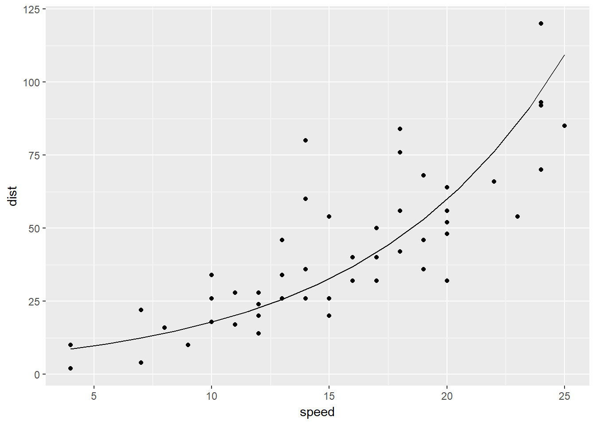


説明変数が対数をとるときの回帰分析は以下を実行する.

```r
fm_2 <- lm(dist ~ log(speed), data=cars)
summary(fm_2)
```

```
## 
## Call:
## lm(formula = dist ~ log(speed), data = cars)
## 
## Residuals:
##     Min      1Q  Median      3Q     Max 
## -26.501 -11.273  -4.466   8.593  53.020 
## 
## Coefficients:
##             Estimate Std. Error t value Pr(>|t|)    
## (Intercept)  -80.822     16.004  -5.050 6.79e-06 ***
## log(speed)    46.507      5.942   7.827 4.02e-10 ***
## ---
## Signif. codes:  0 '***' 0.001 '**' 0.01 '*' 0.05 '.' 0.1 ' ' 1
## 
## Residual standard error: 17.26 on 48 degrees of freedom
## Multiple R-squared:  0.5607,	Adjusted R-squared:  0.5516 
## F-statistic: 61.27 on 1 and 48 DF,  p-value: 4.02e-10
```


```r
cars %>% gf_point(dist ~ log(speed)) %>% gf_lm()
```

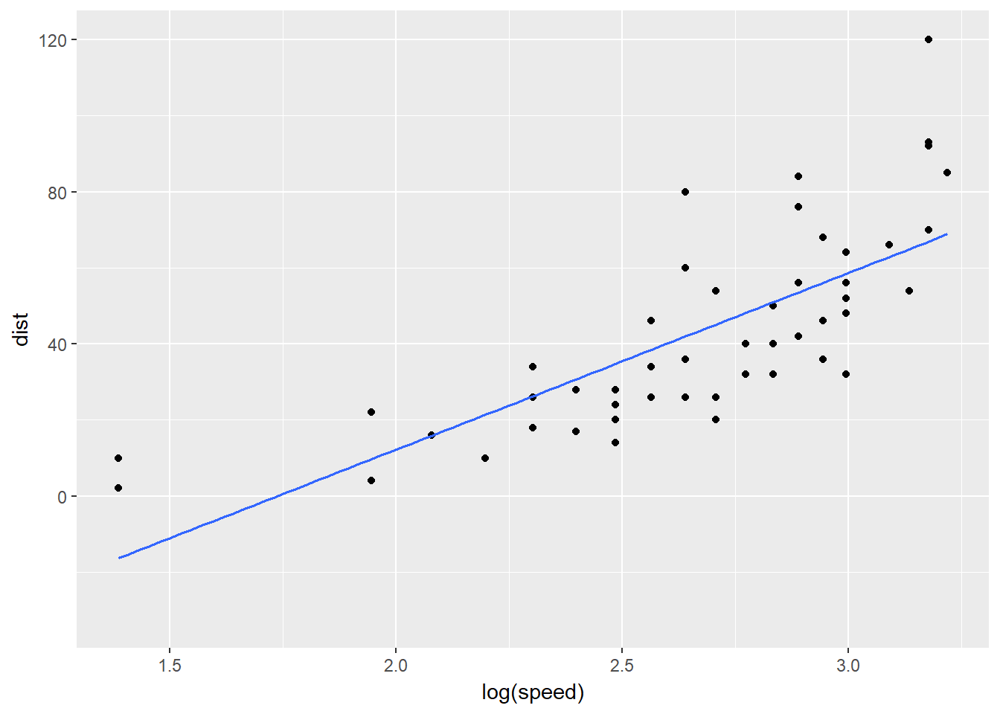


```r
fn2 <- makeFun(fm_2)
cars %>% gf_point(dist ~ log(speed)) %>% gf_fun(fn2(exp(x)) ~ x)
```

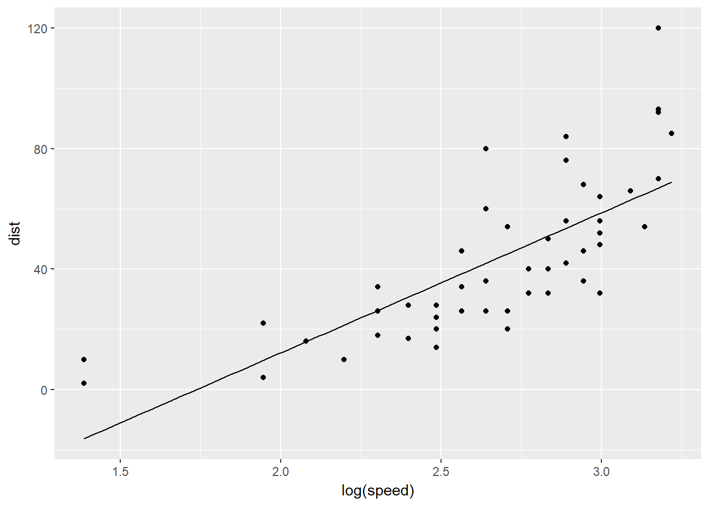


```r
cars %>% gf_point(dist ~ speed) %>% gf_fun(fn2(speed)~speed)
```


```r
grid <- cars %>% data_grid(speed=seq_range(speed,15)) %>%
  add_predictions(fm_2)
cars %>% gf_point(dist ~ speed) %>%
  gf_line(data=grid, pred~speed)
```

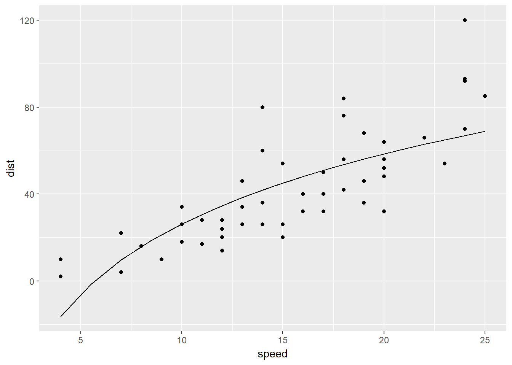


両方が対数をとるときの回帰分析は以下を実行する.

```r
fm_3 <- lm(log(dist) ~ log(speed), data=cars)
summary(fm_3)
```

```
## 
## Call:
## lm(formula = log(dist) ~ log(speed), data = cars)
## 
## Residuals:
##      Min       1Q   Median       3Q      Max 
## -1.00215 -0.24578 -0.02898  0.20717  0.88289 
## 
## Coefficients:
##             Estimate Std. Error t value Pr(>|t|)    
## (Intercept)  -0.7297     0.3758  -1.941   0.0581 .  
## log(speed)    1.6024     0.1395  11.484 2.26e-15 ***
## ---
## Signif. codes:  0 '***' 0.001 '**' 0.01 '*' 0.05 '.' 0.1 ' ' 1
## 
## Residual standard error: 0.4053 on 48 degrees of freedom
## Multiple R-squared:  0.7331,	Adjusted R-squared:  0.7276 
## F-statistic: 131.9 on 1 and 48 DF,  p-value: 2.259e-15
```


```r
cars %>% gf_point(log(dist) ~ log(speed)) %>% gf_lm()
```

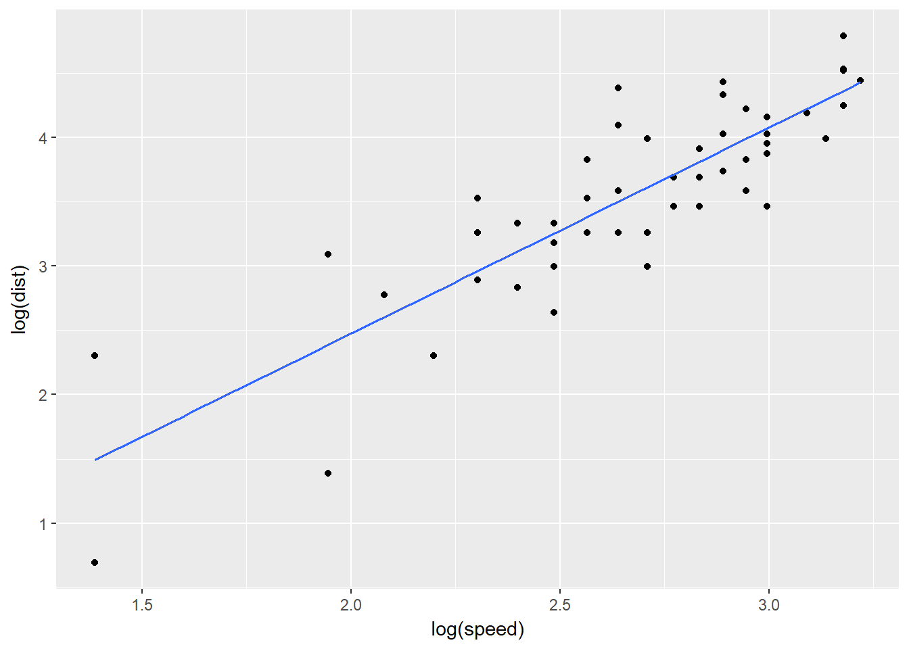


```r
fn3 <- makeFun(fm_3)
cars %>% gf_point(log(dist) ~ log(speed)) %>% gf_fun(log(fn3(exp(x))) ~ x)
```

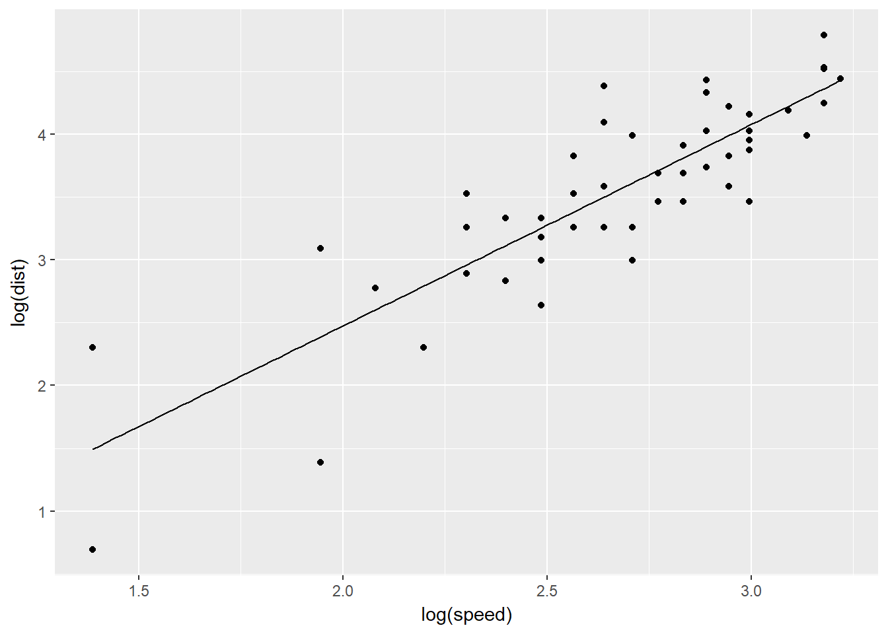


```r
cars %>% gf_point(dist ~ speed) %>% gf_fun(fn3(x) ~ x)
```


```r
grid <- cars %>% data_grid(speed=seq_range(speed,15)) %>%
  add_predictions(fm_3)
cars %>% gf_point(dist ~ speed) %>%
  gf_line(data=grid, exp(pred)~speed)
```

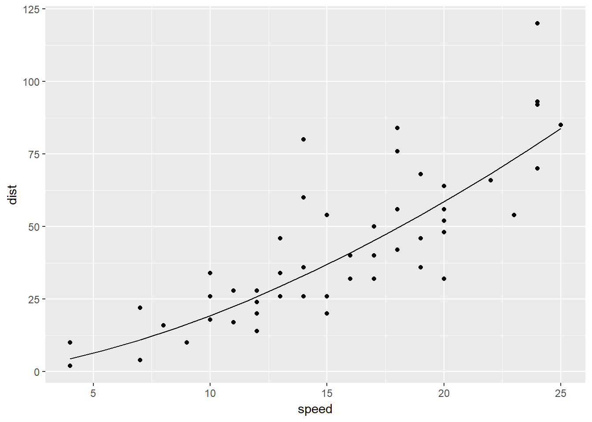


または以下のように実行してもよい.

```r
fm_4 <-lm(dist ~ speed, data=log(cars))
summary(fm_4)
```

```
## 
## Call:
## lm(formula = dist ~ speed, data = log(cars))
## 
## Residuals:
##      Min       1Q   Median       3Q      Max 
## -1.00215 -0.24578 -0.02898  0.20717  0.88289 
## 
## Coefficients:
##             Estimate Std. Error t value Pr(>|t|)    
## (Intercept)  -0.7297     0.3758  -1.941   0.0581 .  
## speed         1.6024     0.1395  11.484 2.26e-15 ***
## ---
## Signif. codes:  0 '***' 0.001 '**' 0.01 '*' 0.05 '.' 0.1 ' ' 1
## 
## Residual standard error: 0.4053 on 48 degrees of freedom
## Multiple R-squared:  0.7331,	Adjusted R-squared:  0.7276 
## F-statistic: 131.9 on 1 and 48 DF,  p-value: 2.259e-15
```


```r
log(cars) %>% gf_point(dist ~ speed) %>% gf_lm()
```

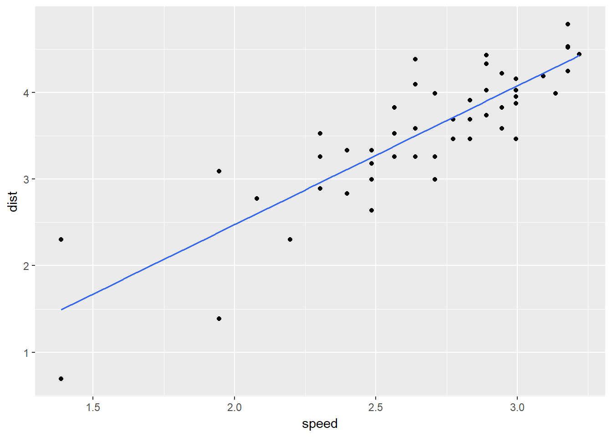


```r
fn4 <- makeFun(fm_4)
log(cars) %>% gf_point(dist ~ speed) %>% gf_fun(fn4(x) ~ x)
```

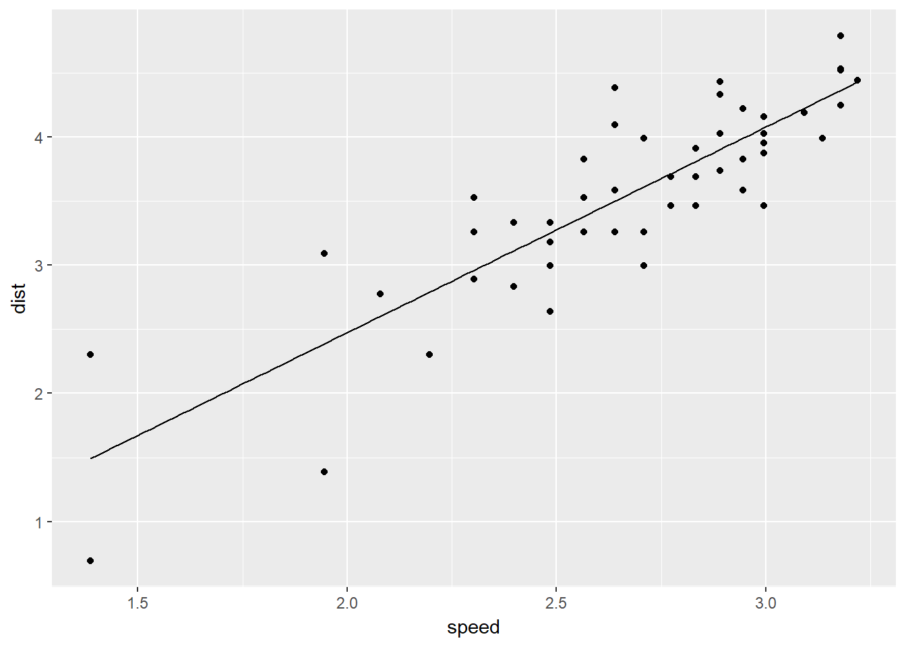


### 多項式

```r
summary(lm(dist ~ speed + I(speed^2), data=cars))
```

```
## 
## Call:
## lm(formula = dist ~ speed + I(speed^2), data = cars)
## 
## Residuals:
##     Min      1Q  Median      3Q     Max 
## -28.720  -9.184  -3.188   4.628  45.152 
## 
## Coefficients:
##             Estimate Std. Error t value Pr(>|t|)
## (Intercept)  2.47014   14.81716   0.167    0.868
## speed        0.91329    2.03422   0.449    0.656
## I(speed^2)   0.09996    0.06597   1.515    0.136
## 
## Residual standard error: 15.18 on 47 degrees of freedom
## Multiple R-squared:  0.6673,	Adjusted R-squared:  0.6532 
## F-statistic: 47.14 on 2 and 47 DF,  p-value: 5.852e-12
```


```r
fm_5 <- lm(dist ~ poly(speed,2,raw=TRUE), data=cars)
summary(fm_5)
```

```
## 
## Call:
## lm(formula = dist ~ poly(speed, 2, raw = TRUE), data = cars)
## 
## Residuals:
##     Min      1Q  Median      3Q     Max 
## -28.720  -9.184  -3.188   4.628  45.152 
## 
## Coefficients:
##                             Estimate Std. Error t value Pr(>|t|)
## (Intercept)                  2.47014   14.81716   0.167    0.868
## poly(speed, 2, raw = TRUE)1  0.91329    2.03422   0.449    0.656
## poly(speed, 2, raw = TRUE)2  0.09996    0.06597   1.515    0.136
## 
## Residual standard error: 15.18 on 47 degrees of freedom
## Multiple R-squared:  0.6673,	Adjusted R-squared:  0.6532 
## F-statistic: 47.14 on 2 and 47 DF,  p-value: 5.852e-12
```


```r
fn5 <- makeFun(fm_5)
cars %>% gf_point(dist ~ speed) %>% gf_fun(fn5(x) ~ x)
```

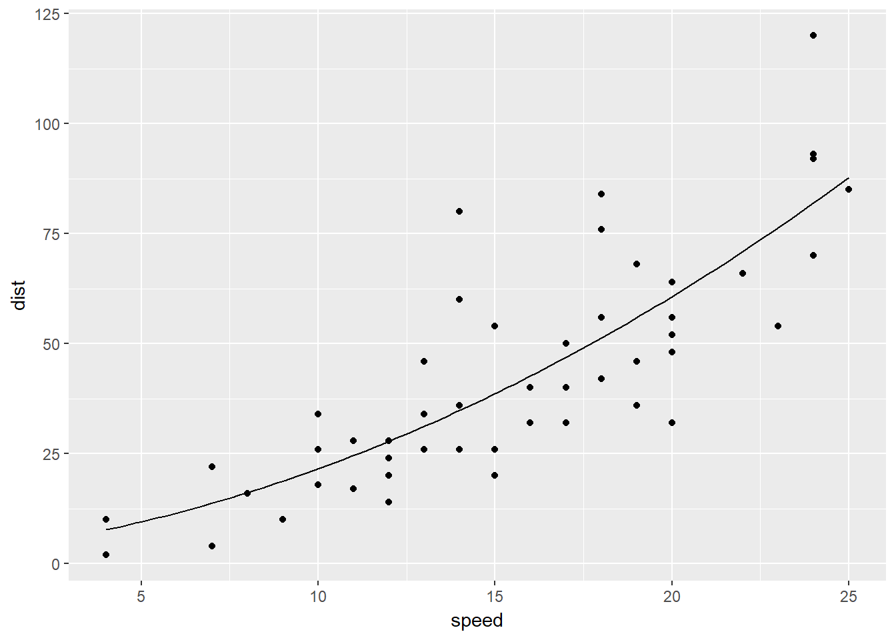


```r
grid <- cars %>% data_grid(speed=seq_range(speed,15)) %>%
  add_predictions(fm_5)
cars %>% gf_point(dist ~ speed) %>%
  gf_line(data=grid, pred~speed)
```


## ダミー変数
### 定数ダミー項
以下のデータを考える.

```r
summary(mtcars)
```

```
##       mpg             cyl             disp             hp       
##  Min.   :10.40   Min.   :4.000   Min.   : 71.1   Min.   : 52.0  
##  1st Qu.:15.43   1st Qu.:4.000   1st Qu.:120.8   1st Qu.: 96.5  
##  Median :19.20   Median :6.000   Median :196.3   Median :123.0  
##  Mean   :20.09   Mean   :6.188   Mean   :230.7   Mean   :146.7  
##  3rd Qu.:22.80   3rd Qu.:8.000   3rd Qu.:326.0   3rd Qu.:180.0  
##  Max.   :33.90   Max.   :8.000   Max.   :472.0   Max.   :335.0  
##       drat             wt             qsec             vs        
##  Min.   :2.760   Min.   :1.513   Min.   :14.50   Min.   :0.0000  
##  1st Qu.:3.080   1st Qu.:2.581   1st Qu.:16.89   1st Qu.:0.0000  
##  Median :3.695   Median :3.325   Median :17.71   Median :0.0000  
##  Mean   :3.597   Mean   :3.217   Mean   :17.85   Mean   :0.4375  
##  3rd Qu.:3.920   3rd Qu.:3.610   3rd Qu.:18.90   3rd Qu.:1.0000  
##  Max.   :4.930   Max.   :5.424   Max.   :22.90   Max.   :1.0000  
##        am              gear            carb      
##  Min.   :0.0000   Min.   :3.000   Min.   :1.000  
##  1st Qu.:0.0000   1st Qu.:3.000   1st Qu.:2.000  
##  Median :0.0000   Median :4.000   Median :2.000  
##  Mean   :0.4062   Mean   :3.688   Mean   :2.812  
##  3rd Qu.:1.0000   3rd Qu.:4.000   3rd Qu.:4.000  
##  Max.   :1.0000   Max.   :5.000   Max.   :8.000
```

`am` が0から1を取るダミー変数である.

```r
fm<-lm(mpg ~ disp + am, data =mtcars)
summary(fm)
```

```
## 
## Call:
## lm(formula = mpg ~ disp + am, data = mtcars)
## 
## Residuals:
##     Min      1Q  Median      3Q     Max 
## -4.6382 -2.4751 -0.5631  2.2333  6.8386 
## 
## Coefficients:
##              Estimate Std. Error t value Pr(>|t|)    
## (Intercept) 27.848081   1.834071  15.184 2.45e-15 ***
## disp        -0.036851   0.005782  -6.373 5.75e-07 ***
## am           1.833458   1.436100   1.277    0.212    
## ---
## Signif. codes:  0 '***' 0.001 '**' 0.01 '*' 0.05 '.' 0.1 ' ' 1
## 
## Residual standard error: 3.218 on 29 degrees of freedom
## Multiple R-squared:  0.7333,	Adjusted R-squared:  0.7149 
## F-statistic: 39.87 on 2 and 29 DF,  p-value: 4.749e-09
```
図示すると以下になる.

```r
fn <- makeFun(fm)
mtcars %>% gf_point(mpg ~ disp) %>% 
  gf_fun(fn(x, am=0) ~ x, color="red") %>% 
  gf_fun(fn(x, am=1) ~ x, color="blue")
```

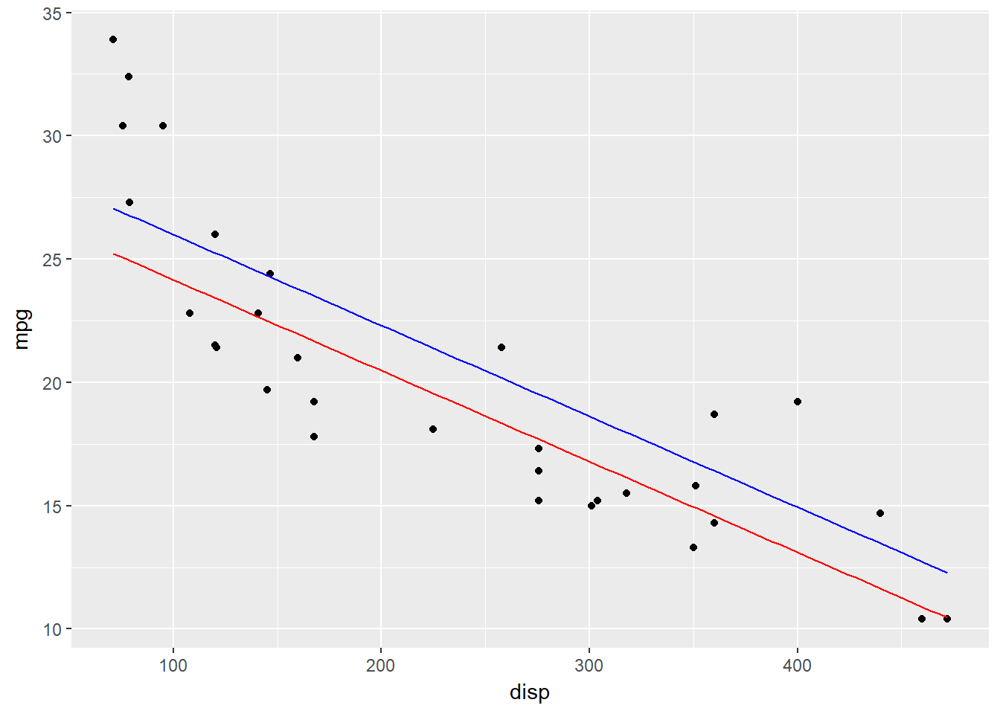


```r
grid <- mtcars %>% data_grid(disp=seq_range(disp,15), am=c(0,1)) %>%
  add_predictions(fm)
mtcars %>% gf_point(mpg ~ disp, color=~factor(am)) %>% 
  gf_line(data=grid, pred~disp)
```

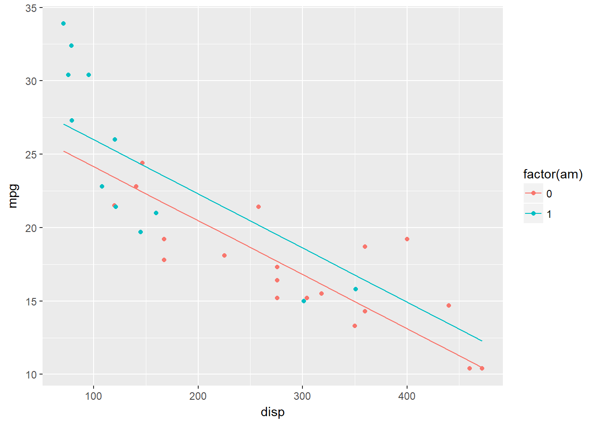


```r
mtcars %>% gf_point(mpg ~ disp, color=~factor(am)) %>% 
  gf_line(data=grid, pred~disp|factor(am))
```

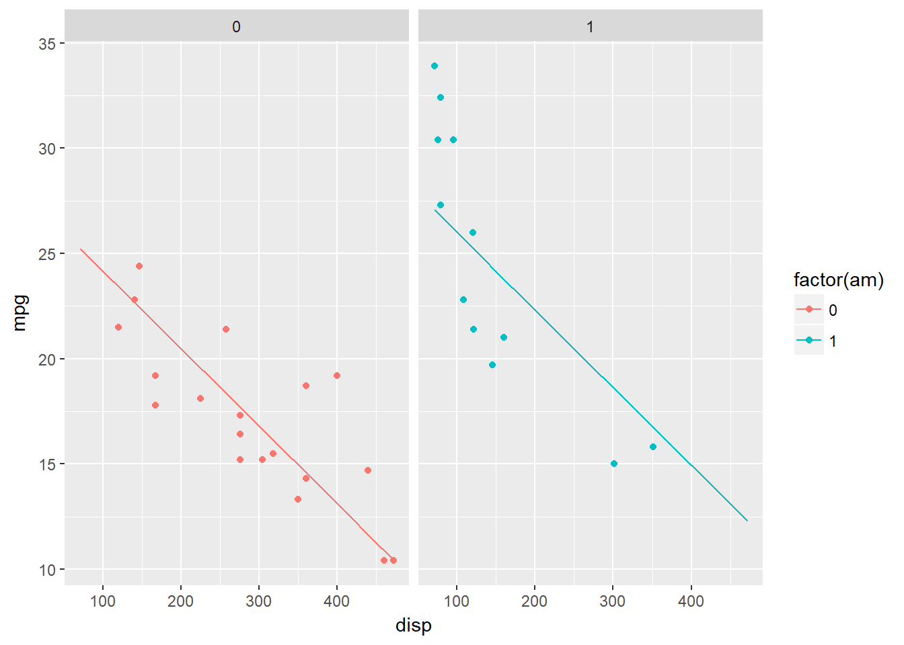


Rでは三種類の値をとる因子ベクトルも説明変数に加えれる.

```r
fm1<-lm(mpg ~ disp + factor(cyl), data =mtcars)
summary(fm1)
```

```
## 
## Call:
## lm(formula = mpg ~ disp + factor(cyl), data = mtcars)
## 
## Residuals:
##     Min      1Q  Median      3Q     Max 
## -4.8304 -1.5873 -0.5851  0.9753  6.3069 
## 
## Coefficients:
##              Estimate Std. Error t value Pr(>|t|)    
## (Intercept)  29.53477    1.42662  20.703  < 2e-16 ***
## disp         -0.02731    0.01061  -2.574  0.01564 *  
## factor(cyl)6 -4.78585    1.64982  -2.901  0.00717 ** 
## factor(cyl)8 -4.79209    2.88682  -1.660  0.10808    
## ---
## Signif. codes:  0 '***' 0.001 '**' 0.01 '*' 0.05 '.' 0.1 ' ' 1
## 
## Residual standard error: 2.95 on 28 degrees of freedom
## Multiple R-squared:  0.7837,	Adjusted R-squared:  0.7605 
## F-statistic: 33.81 on 3 and 28 DF,  p-value: 1.906e-09
```
図示すると以下になる.

```r
fn1 <- makeFun(fm1)
mtcars %>% gf_point(mpg ~ disp) %>% 
  gf_fun(fn1(x, cyl = "4") ~ x, color="blue") %>% 
  gf_fun(fn1(x, cyl = "6") ~ x, color="red") %>% 
  gf_fun(fn1(x, cyl = "8") ~ x, color="pink")
```

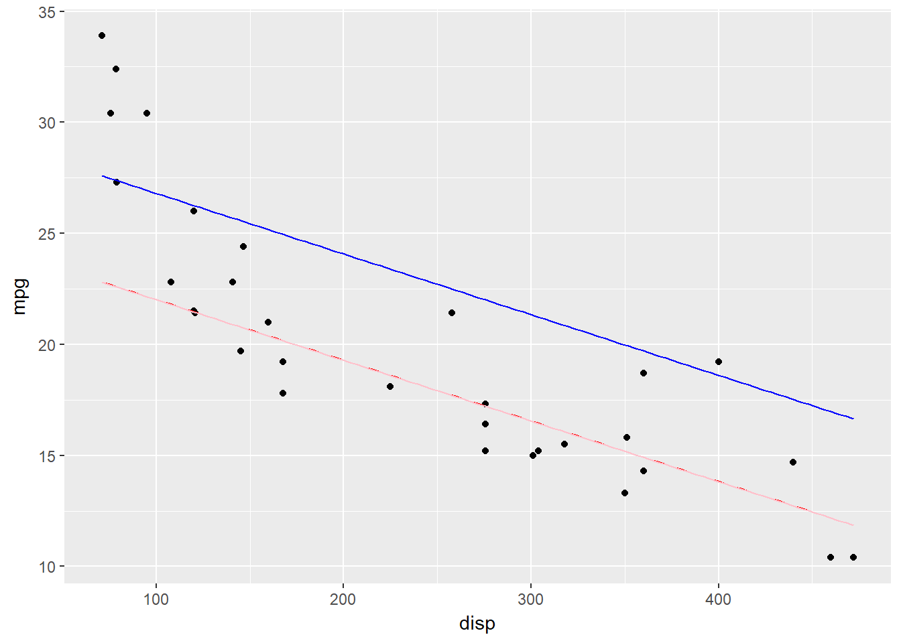
6と8はほぼ同じなため重なってしまう.


```r
grid <- mtcars %>% 
  data_grid(disp=seq_range(disp,15), cyl=factor(cyl)) %>%
  add_predictions(fm1)
mtcars %>% gf_point(mpg ~ disp, color=~factor(cyl)) %>% 
  gf_line(data=grid, pred ~ disp)
```

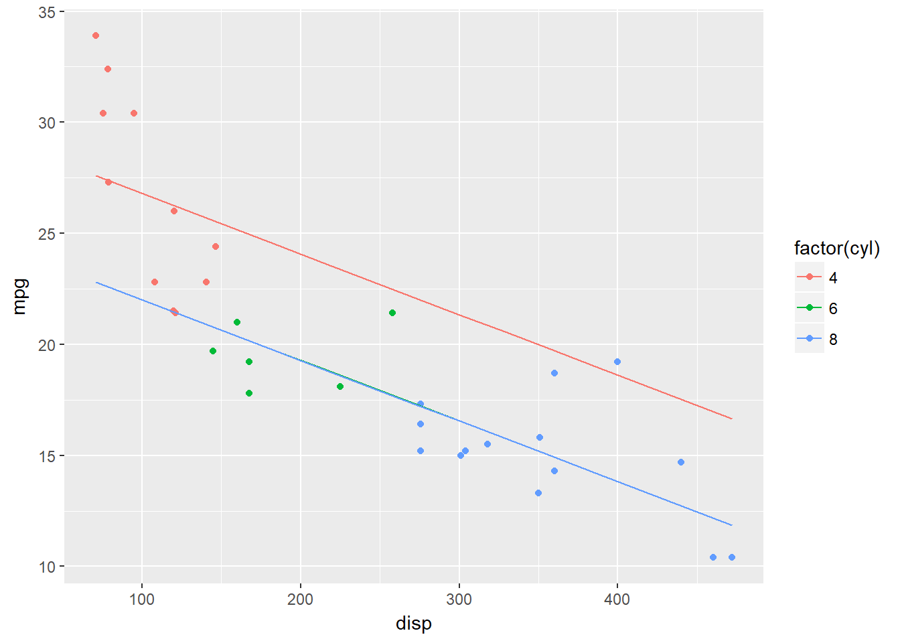


```r
mtcars %>% gf_point(mpg ~ disp, color=~factor(cyl)) %>% 
  gf_line(data=grid, pred ~ disp|factor(cyl))
```

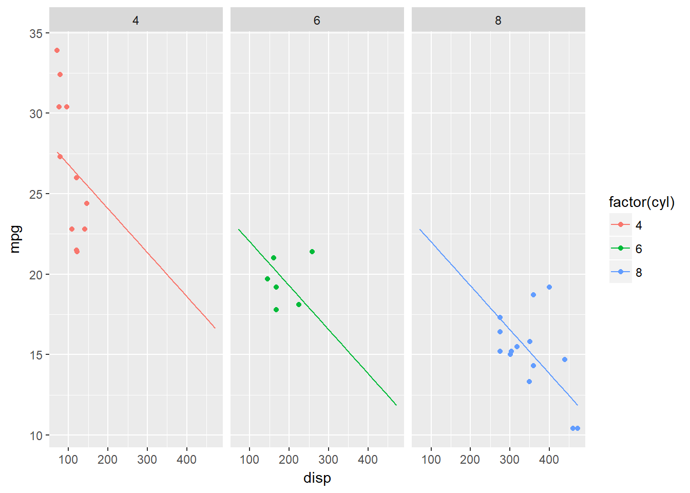


### 交差項

```r
fm2<-lm(mpg ~ disp + factor(cyl) + disp:factor(cyl), data =mtcars)
summary(fm2)
```

```
## 
## Call:
## lm(formula = mpg ~ disp + factor(cyl) + disp:factor(cyl), data = mtcars)
## 
## Residuals:
##     Min      1Q  Median      3Q     Max 
## -3.4766 -1.8101 -0.2297  1.3523  5.0208 
## 
## Coefficients:
##                    Estimate Std. Error t value Pr(>|t|)    
## (Intercept)        40.87196    3.02012  13.533 2.79e-13 ***
## disp               -0.13514    0.02791  -4.842 5.10e-05 ***
## factor(cyl)6      -21.78997    5.30660  -4.106 0.000354 ***
## factor(cyl)8      -18.83916    4.61166  -4.085 0.000374 ***
## disp:factor(cyl)6   0.13875    0.03635   3.817 0.000753 ***
## disp:factor(cyl)8   0.11551    0.02955   3.909 0.000592 ***
## ---
## Signif. codes:  0 '***' 0.001 '**' 0.01 '*' 0.05 '.' 0.1 ' ' 1
## 
## Residual standard error: 2.372 on 26 degrees of freedom
## Multiple R-squared:  0.8701,	Adjusted R-squared:  0.8452 
## F-statistic: 34.84 on 5 and 26 DF,  p-value: 9.968e-11
```


```r
fm2<-lm(mpg ~ disp * factor(cyl), data =mtcars)
summary(fm2)
```

```
## 
## Call:
## lm(formula = mpg ~ disp * factor(cyl), data = mtcars)
## 
## Residuals:
##     Min      1Q  Median      3Q     Max 
## -3.4766 -1.8101 -0.2297  1.3523  5.0208 
## 
## Coefficients:
##                    Estimate Std. Error t value Pr(>|t|)    
## (Intercept)        40.87196    3.02012  13.533 2.79e-13 ***
## disp               -0.13514    0.02791  -4.842 5.10e-05 ***
## factor(cyl)6      -21.78997    5.30660  -4.106 0.000354 ***
## factor(cyl)8      -18.83916    4.61166  -4.085 0.000374 ***
## disp:factor(cyl)6   0.13875    0.03635   3.817 0.000753 ***
## disp:factor(cyl)8   0.11551    0.02955   3.909 0.000592 ***
## ---
## Signif. codes:  0 '***' 0.001 '**' 0.01 '*' 0.05 '.' 0.1 ' ' 1
## 
## Residual standard error: 2.372 on 26 degrees of freedom
## Multiple R-squared:  0.8701,	Adjusted R-squared:  0.8452 
## F-statistic: 34.84 on 5 and 26 DF,  p-value: 9.968e-11
```


```r
fn2 <- makeFun(fm2)
mtcars %>% gf_point(mpg ~ disp, color = ~factor(cyl)) %>% 
  gf_fun(fn2(x, cyl = "4") ~ x, color="red") %>% 
  gf_fun(fn2(x, cyl = "6") ~ x, color="green") %>% 
  gf_fun(fn2(x, cyl = "8") ~ x, color="blue")
```

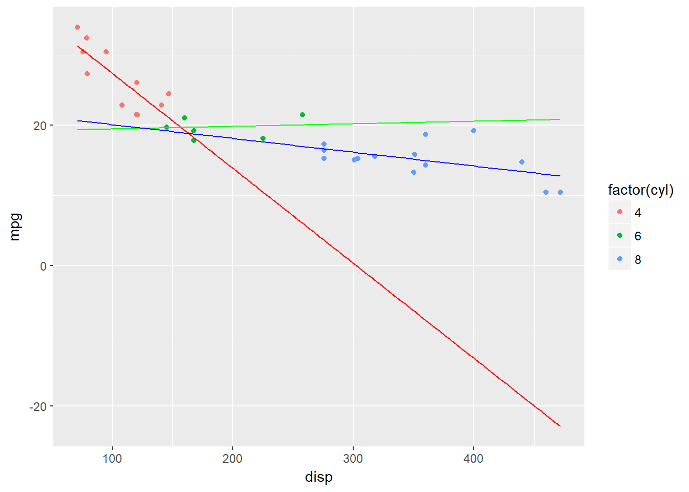


```r
grid <- mtcars %>% 
  data_grid(disp=seq_range(disp,15), cyl=factor(cyl)) %>%
  add_predictions(fm2)
```


```r
mtcars %>% gf_point(mpg ~ disp, color=~factor(cyl)) %>% 
  gf_line(data=grid, pred~disp)
```

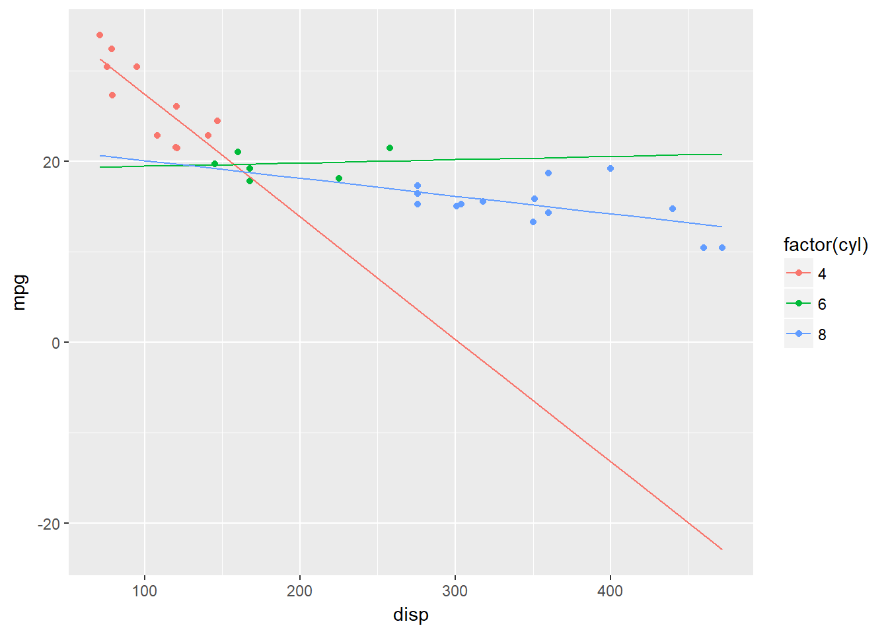


```r
mtcars %>% gf_point(mpg ~ disp, color=~factor(cyl)) %>% 
  gf_line(data=grid, pred~disp|factor(cyl))
```

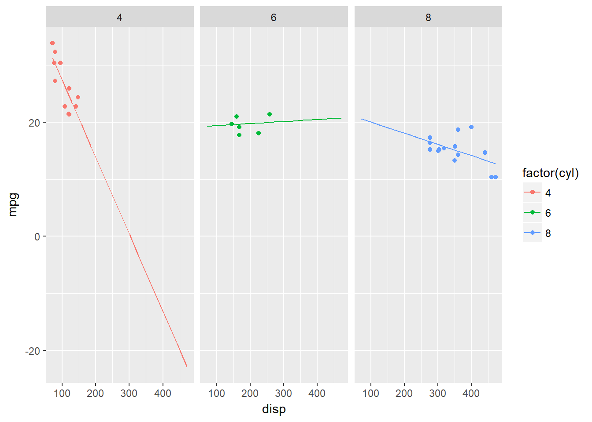


```r
grid <- mtcars %>% 
  data_grid(disp=seq_range(disp,15), cyl=factor(cyl)) %>%
  gather_predictions(fm1,fm2)
mtcars %>% gf_point(mpg ~ disp, color=~factor(cyl)) %>% 
  gf_line(data=grid, pred~disp|model)
```

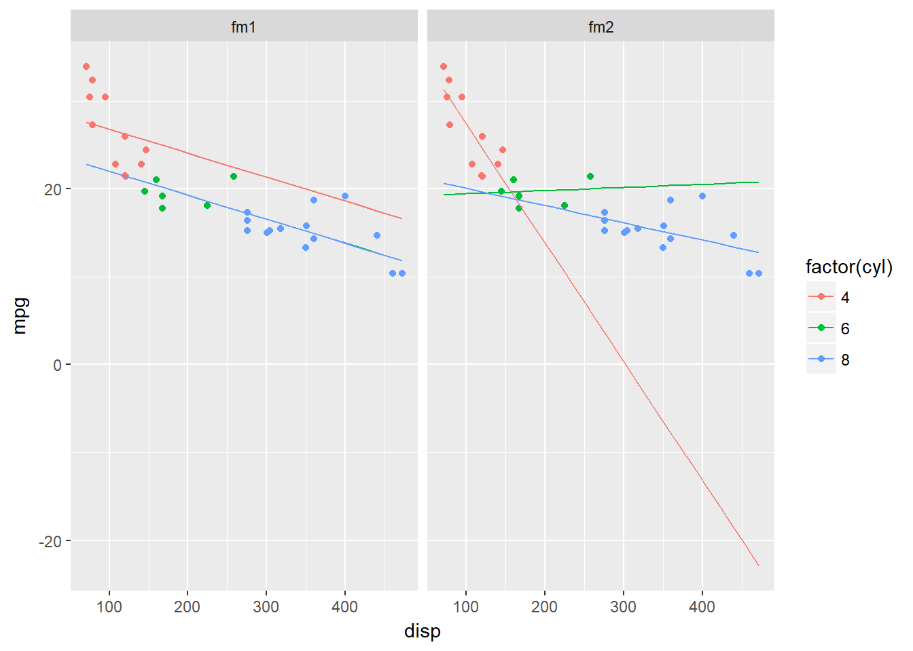


## F検定
個々の説明変数の有意性はティー検定を実施すればよい.
複数の場合はエフ検定を実施する.

```r
anova(fm1,fm2)
```

```
## Analysis of Variance Table
## 
## Model 1: mpg ~ disp + factor(cyl)
## Model 2: mpg ~ disp * factor(cyl)
##   Res.Df    RSS Df Sum of Sq      F   Pr(>F)   
## 1     28 243.62                                
## 2     26 146.23  2    97.386 8.6574 0.001313 **
## ---
## Signif. codes:  0 '***' 0.001 '**' 0.01 '*' 0.05 '.' 0.1 ' ' 1
```


## ロバスト分散
説明変数と誤差項が互いに独立とは言い切れず,
せいぜい無相関の場合, 最小二乗推定量は不偏でなく一致である.
漸近的に正規分布にしたがうが,
係数の分散の計算方法を変える必要がある.


```r
library(AER)
coeftest(fm2,vcov=vcovHC(fm2,type="HC1"),df = Inf)
```

```
## 
## z test of coefficients:
## 
##                     Estimate Std. Error z value  Pr(>|z|)    
## (Intercept)        40.871955   3.365408 12.1447 < 2.2e-16 ***
## disp               -0.135142   0.032030 -4.2192 2.452e-05 ***
## factor(cyl)6      -21.789968   4.267759 -5.1057 3.295e-07 ***
## factor(cyl)8      -18.839156   4.437738 -4.2452 2.184e-05 ***
## disp:factor(cyl)6   0.138747   0.035304  3.9301 8.491e-05 ***
## disp:factor(cyl)8   0.115508   0.033329  3.4657 0.0005289 ***
## ---
## Signif. codes:  0 '***' 0.001 '**' 0.01 '*' 0.05 '.' 0.1 ' ' 1
```


```r
waldtest(fm1,fm2,vcov=vcovHC(fm2,type="HC1"),test="Chisq")
```

```
## Wald test
## 
## Model 1: mpg ~ disp + factor(cyl)
## Model 2: mpg ~ disp * factor(cyl)
##   Res.Df Df  Chisq Pr(>Chisq)    
## 1     28                         
## 2     26  2 15.452  0.0004412 ***
## ---
## Signif. codes:  0 '***' 0.001 '**' 0.01 '*' 0.05 '.' 0.1 ' ' 1
```

