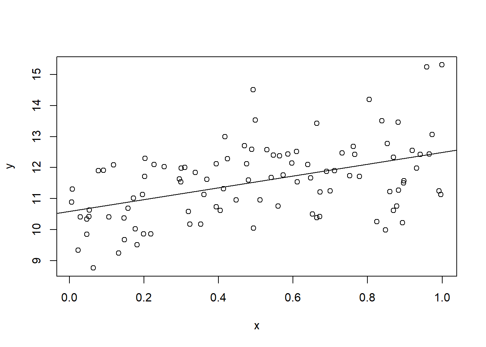
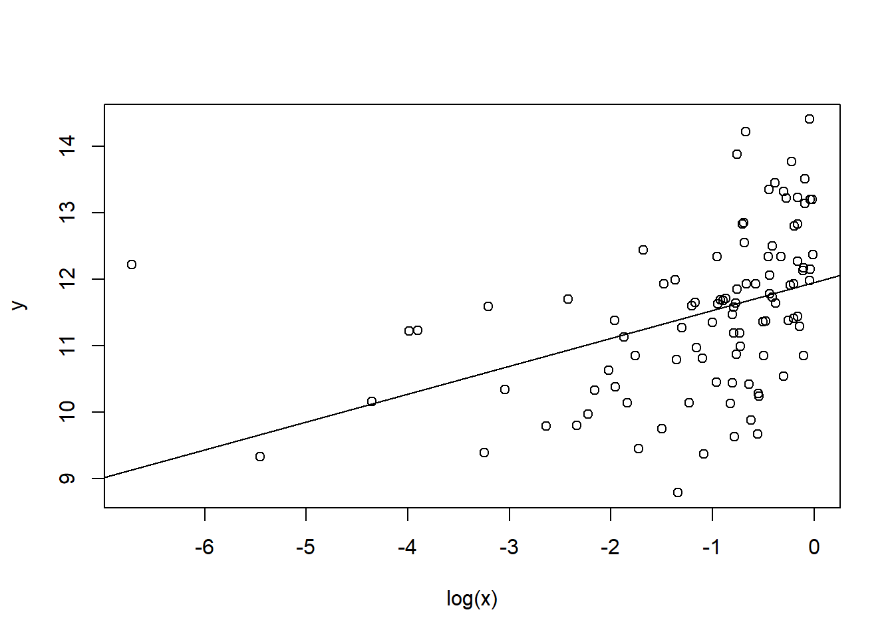
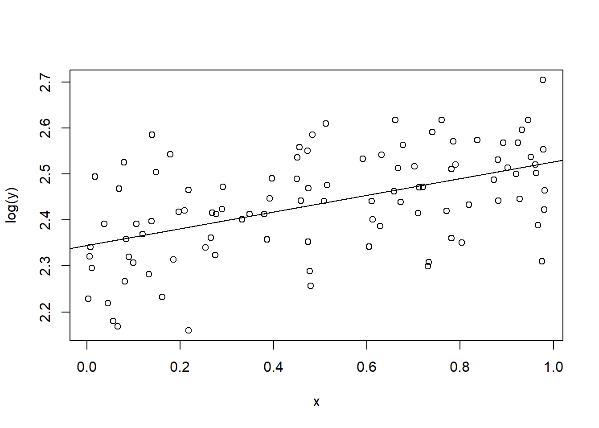

# 回帰分析


```r
library(AER)
```


仮想的に以下のようにデータを生成する.

```r
N <- 100
x<-runif(N)
w<-sample(c("H","T"),N,replace=TRUE)
y <- 10 + 2*x + ifelse(w=="H",1,0) + rnorm(N)
df <- data.frame(w,x,y)
```


```r
plot(y~x)
```


## 単回帰モデル
次の単回帰モデルを考えてる.
$x$ は説明変数で, 
$y$ は被説明変数である.
$u$ は誤差項である.
パラメータとして $\alpha$ は切片パラメータ, $\beta$ は傾きパラメータである.

$$
y = \alpha + \beta x + u
$$

次の仮定を置いている.

+ $(x_i,y_i)$ は独立同一分布にしたがう.
+ $E[u_i]=0$ である.
+ $u_i$ と $x_i$ は独立である.
+ $u_i$ は正規分布にしたがう.

このとき最小二乗推定量は一致で, 不偏であり, 正規分布にしたがう.
一致とは推定量が観測値を増やすことによって真のパラメータに (確率) 収束することある.
不偏とは推定量の期待値が真のパラメータになることである.
また他の線形不偏推定量のなかで最も分散が小さいことも知られている.


R で回帰分析を実施するには `lm` を実施する.

```r
fm <- lm(y ~ x, data=df)
```

`fm` 自体はリストであり, 以下の要素がある.

```r
typeof(fm)
## [1] "list"
names(fm)
##  [1] "coefficients"  "residuals"     "effects"       "rank"         
##  [5] "fitted.values" "assign"        "qr"            "df.residual"  
##  [9] "xlevels"       "call"          "terms"         "model"
```

係数は次のコマンドを実施する.

```r
coef(fm)
## (Intercept)           x 
##   10.472808    2.048814
# coefficients(fm)
```

作図すると以下のようになる.

```r
plot(y~x,data=df)
abline(fm)
```




残差は次のコマンドを実施する.

```r
head(resid(fm))
##           1           2           3           4           5           6 
## -0.81984155 -1.18699001 -1.85942334  0.36753169 -0.03329058 -0.75003741
# residuals(fm)
# with(fm, residuals)
```

予測値は次のコマンドを実施する.

```r
head(fitted(fm))
##        1        2        3        4        5        6 
## 11.03716 10.47849 10.60722 11.52772 10.71846 12.15111
# fitted.values(fm)
# with(fm, fitted.values)
```

残差自乗和は次のコマンドを実施する.

```r
deviance(fm)
## [1] 118.0346
sum(resid(fm)^2)
## [1] 118.0346
```

### ティー検定
その結果を見るには `summary` を実施する.

```r
summary(fm)
## 
## Call:
## lm(formula = y ~ x, data = df)
## 
## Residuals:
##      Min       1Q   Median       3Q      Max 
## -2.39983 -0.74397 -0.02491  0.74739  2.51129 
## 
## Coefficients:
##             Estimate Std. Error t value Pr(>|t|)    
## (Intercept)  10.4728     0.2062  50.794  < 2e-16 ***
## x             2.0488     0.3471   5.902 5.15e-08 ***
## ---
## Signif. codes:  0 '***' 0.001 '**' 0.01 '*' 0.05 '.' 0.1 ' ' 1
## 
## Residual standard error: 1.097 on 98 degrees of freedom
## Multiple R-squared:  0.2623,	Adjusted R-squared:  0.2547 
## F-statistic: 34.84 on 1 and 98 DF,  p-value: 5.147e-08
```

これをみれば各変数の係数がゼロのティー検定も可能である.
他にも, 残差標準誤差, 決定係数, 修正済み決定係数, 全ての係数がゼロであるF検定も可能である.


`summary(fm)` もリストであり, それぞれの要素は以下である.

```r
typeof(summary(fm))
## [1] "list"
names(summary(fm))
##  [1] "call"          "terms"         "residuals"     "coefficients" 
##  [5] "aliased"       "sigma"         "df"            "r.squared"    
##  [9] "adj.r.squared" "fstatistic"    "cov.unscaled"
```

単なる `fm` と同じ名前もあるが, 中身が違っている場合もある.
例えば `residuals` は同じであるが, 係数はより情報が加わっている.

```r
coef(summary(fm))
##              Estimate Std. Error   t value     Pr(>|t|)
## (Intercept) 10.472808  0.2061813 50.794165 3.312337e-72
## x            2.048814  0.3471142  5.902423 5.147156e-08
# coefficients(summary(fm))
```

残差の標準誤差

```r
sqrt(deviance(fm)/df.residual(fm))
## [1] 1.097467
with(summary(fm),sigma)
## [1] 1.097467
```

決定係数は次のようにして計算する.

```r
1-deviance(fm)/with(df, sum((y-mean(y))^2))
## [1] 0.2622626
with(summary(fm),r.squared)
## [1] 0.2622626
```

調整済み決定係数は次のようにして計算する.

```r
1-(deviance(fm)/df.residual(fm))/with(df, sum((y-mean(y))^2/(nrow(df)-1)))
## [1] 0.2547347
with(summary(fm),adj.r.squared)
## [1] 0.2547347
```


### 対数変換
次のモデルを考える.
$$
y = \alpha + \beta \log(x) + u
$$

対数変換をおこなう場合, `log` を用いるとよい.

```r
fm <- lm(y~log(x),data=df)
summary(fm)
## 
## Call:
## lm(formula = y ~ log(x), data = df)
## 
## Residuals:
##      Min       1Q   Median       3Q      Max 
## -2.62123 -0.77885 -0.02688  0.79448  2.88979 
## 
## Coefficients:
##             Estimate Std. Error t value Pr(>|t|)    
## (Intercept) 12.06829    0.15064  80.111  < 2e-16 ***
## log(x)       0.51178    0.09187   5.571 2.22e-07 ***
## ---
## Signif. codes:  0 '***' 0.001 '**' 0.01 '*' 0.05 '.' 0.1 ' ' 1
## 
## Residual standard error: 1.114 on 98 degrees of freedom
## Multiple R-squared:  0.2405,	Adjusted R-squared:  0.2328 
## F-statistic: 31.04 on 1 and 98 DF,  p-value: 2.224e-07
```

作図すると以下のようになる.

```r
plot(y~log(x),data=df)
abline(fm)
```



被説明変数が対数の場合も同様である.

```r
fm <- lm(log(y)~x,data=df)
summary(fm)
## 
## Call:
## lm(formula = log(y) ~ x, data = df)
## 
## Residuals:
##       Min        1Q    Median        3Q       Max 
## -0.225056 -0.061134  0.003044  0.065015  0.215131 
## 
## Coefficients:
##             Estimate Std. Error t value Pr(>|t|)    
## (Intercept)  2.34501    0.01816 129.113  < 2e-16 ***
## x            0.18186    0.03058   5.947 4.21e-08 ***
## ---
## Signif. codes:  0 '***' 0.001 '**' 0.01 '*' 0.05 '.' 0.1 ' ' 1
## 
## Residual standard error: 0.09668 on 98 degrees of freedom
## Multiple R-squared:  0.2652,	Adjusted R-squared:  0.2577 
## F-statistic: 35.37 on 1 and 98 DF,  p-value: 4.207e-08
```

作図すると以下のようになる.

```r
plot(log(y)~x,data=df)
abline(fm)
```




### 切片なし回帰モデル
次のモデルを考える.
$$
y = \beta x + u
$$

切片なしモデルを推定したい場合は次のように `-1` とする.

```r
fm <- lm(y~x-1,data=df)
summary(fm)
## 
## Call:
## lm(formula = y ~ x - 1, data = df)
## 
## Residuals:
##    Min     1Q Median     3Q    Max 
## -6.486 -1.234  3.005  7.112 11.820 
## 
## Coefficients:
##   Estimate Std. Error t value Pr(>|t|)    
## x   16.975      0.961   17.66   <2e-16 ***
## ---
## Signif. codes:  0 '***' 0.001 '**' 0.01 '*' 0.05 '.' 0.1 ' ' 1
## 
## Residual standard error: 5.708 on 99 degrees of freedom
## Multiple R-squared:  0.7591,	Adjusted R-squared:  0.7567 
## F-statistic:   312 on 1 and 99 DF,  p-value: < 2.2e-16
```

もしくは `+0` を加える.

```r
fm <- lm(y~x+0,data=df)
summary(fm)
## 
## Call:
## lm(formula = y ~ x + 0, data = df)
## 
## Residuals:
##    Min     1Q Median     3Q    Max 
## -6.486 -1.234  3.005  7.112 11.820 
## 
## Coefficients:
##   Estimate Std. Error t value Pr(>|t|)    
## x   16.975      0.961   17.66   <2e-16 ***
## ---
## Signif. codes:  0 '***' 0.001 '**' 0.01 '*' 0.05 '.' 0.1 ' ' 1
## 
## Residual standard error: 5.708 on 99 degrees of freedom
## Multiple R-squared:  0.7591,	Adjusted R-squared:  0.7567 
## F-statistic:   312 on 1 and 99 DF,  p-value: < 2.2e-16
```


## 重回帰モデル
説明変数として $w$ を加えたモデルを考える.
$$
y = \alpha + \beta x +\gamma w+ u
$$

暗黙に次の仮定を置いている.

+ $(w_i, x_i,y_i)$ は独立同一分布にしたがう.
+ 誤差項の期待値はゼロである. $E[u_i]=0$ である.
+ 誤差項 $u_i$ は説明変数 $(x_i, w_i)$ に対して独立である.
+ 誤差項 $u_i$ は正規分布にしたがう.
+ 説明変数間に多重共線性は存在しない. つまり $x_i$ は $w_i$ の一次変換で表せない.

説明変数を加えたいときには `+` と変数名を使うことができる. 

```r
fm <- lm(y~x+w,data=df)
summary(fm)
## 
## Call:
## lm(formula = y ~ x + w, data = df)
## 
## Residuals:
##      Min       1Q   Median       3Q      Max 
## -2.75143 -0.54065  0.09165  0.70291  2.01589 
## 
## Coefficients:
##             Estimate Std. Error t value Pr(>|t|)    
## (Intercept)  10.9609     0.2126  51.569  < 2e-16 ***
## x             2.1011     0.3141   6.690 1.44e-09 ***
## wT           -0.9526     0.1992  -4.782 6.20e-06 ***
## ---
## Signif. codes:  0 '***' 0.001 '**' 0.01 '*' 0.05 '.' 0.1 ' ' 1
## 
## Residual standard error: 0.9923 on 97 degrees of freedom
## Multiple R-squared:  0.403,	Adjusted R-squared:  0.3907 
## F-statistic: 32.74 on 2 and 97 DF,  p-value: 1.366e-11
```

R の特徴は因子もとくに変換することなくダミー変数として扱える.

### 自乗項
説明変数として自乗項を加えたモデルを考える.
$$
y = \alpha + \beta x + \gamma x^2 + u
$$

R では単に自乗するのでなく `I(x^2)` としなければならない.

```r
fm <- lm(y~x+I(x^2),data=df)
summary(fm)
## 
## Call:
## lm(formula = y ~ x + I(x^2), data = df)
## 
## Residuals:
##      Min       1Q   Median       3Q      Max 
## -2.28535 -0.76510  0.03674  0.70698  2.66877 
## 
## Coefficients:
##             Estimate Std. Error t value Pr(>|t|)    
## (Intercept)  10.2495     0.2877  35.628   <2e-16 ***
## x             3.5565     1.3996   2.541   0.0126 *  
## I(x^2)       -1.5157     1.3632  -1.112   0.2689    
## ---
## Signif. codes:  0 '***' 0.001 '**' 0.01 '*' 0.05 '.' 0.1 ' ' 1
## 
## Residual standard error: 1.096 on 97 degrees of freedom
## Multiple R-squared:  0.2715,	Adjusted R-squared:  0.2565 
## F-statistic: 18.08 on 2 and 97 DF,  p-value: 2.121e-07
```

### 交差項
説明変数として交差項を加えたモデルを考える.
$$
y = \alpha + \beta x + \gamma w + \delta xw + u
$$

説明変数 `x` と `w`の自乗項は自乗項は `x:w` である.

```r
fm<-lm(y~x+w+x:w,data=df)
summary(fm)
## 
## Call:
## lm(formula = y ~ x + w + x:w, data = df)
## 
## Residuals:
##     Min      1Q  Median      3Q     Max 
## -2.8017 -0.6040  0.0919  0.7009  2.0210 
## 
## Coefficients:
##             Estimate Std. Error t value Pr(>|t|)    
## (Intercept)  11.0515     0.2778  39.784  < 2e-16 ***
## x             1.9167     0.4803   3.991 0.000129 ***
## wT           -1.1148     0.3762  -2.964 0.003834 ** 
## x:wT          0.3241     0.6366   0.509 0.611849    
## ---
## Signif. codes:  0 '***' 0.001 '**' 0.01 '*' 0.05 '.' 0.1 ' ' 1
## 
## Residual standard error: 0.9962 on 96 degrees of freedom
## Multiple R-squared:  0.4046,	Adjusted R-squared:  0.386 
## F-statistic: 21.74 on 3 and 96 DF,  p-value: 7.899e-11
```

もしくは以下のように `*` を使って簡便的に表せる.

```r
fm <- lm(y~x*w,data=df)
summary(fm)
## 
## Call:
## lm(formula = y ~ x * w, data = df)
## 
## Residuals:
##     Min      1Q  Median      3Q     Max 
## -2.8017 -0.6040  0.0919  0.7009  2.0210 
## 
## Coefficients:
##             Estimate Std. Error t value Pr(>|t|)    
## (Intercept)  11.0515     0.2778  39.784  < 2e-16 ***
## x             1.9167     0.4803   3.991 0.000129 ***
## wT           -1.1148     0.3762  -2.964 0.003834 ** 
## x:wT          0.3241     0.6366   0.509 0.611849    
## ---
## Signif. codes:  0 '***' 0.001 '**' 0.01 '*' 0.05 '.' 0.1 ' ' 1
## 
## Residual standard error: 0.9962 on 96 degrees of freedom
## Multiple R-squared:  0.4046,	Adjusted R-squared:  0.386 
## F-statistic: 21.74 on 3 and 96 DF,  p-value: 7.899e-11
```

### エフ検定
今, 帰無仮説が
$$
y = \alpha + \beta x + u
$$
で, 対立仮説が
$$
y = \alpha + \beta x + \gamma w + \delta xw + u
$$
となる検定を実施したい. 

これは複数の係数がゼロであるエフ検定である.
対立仮説の残差自乗和を $SSR$ とし, その自由度を $df$ とする.
自由度は観測数から説明変数の数を減じた数である.
帰無仮説の残差自乗和を $SSR_0$ とし, 制約の数を $q$ とする.
制約の数は帰無仮説の自由度から帰無仮説の自由度を差し引いた数である.
このとき, 以下のF値は帰無仮説が正しいもと自由度 $df$ と $q$ のF分布にしたがう.
$$
\frac{(SSR_0-SSR)/q}{SSR/df}
$$

R でF値は次のようにして算出する.

```r
fm0 <- lm(y~x,data=df)
fm1 <- lm(y~x*w,data=df)
dof <- fm1$df
q <- fm0$df-dof
SSR0 <- deviance(fm0)
SSR <- deviance(fm1)
(F <- ((SSR0-SSR)/q)/(SSR/dof))
## [1] 11.47382
```

この時のP値は以下である.

```r
1-pf(F,df1=q,df2=dof)
## [1] 3.403611e-05
```

これらの手順はコマンド `anova` を用いれば簡単に実現できる.

```r
anova(fm0,fm1)
## Analysis of Variance Table
## 
## Model 1: y ~ x
## Model 2: y ~ x * w
##   Res.Df     RSS Df Sum of Sq      F    Pr(>F)    
## 1     98 118.035                                  
## 2     96  95.263  2    22.771 11.474 3.404e-05 ***
## ---
## Signif. codes:  0 '***' 0.001 '**' 0.01 '*' 0.05 '.' 0.1 ' ' 1
```

順番を変えても, 検定統計量自体に変更はない.

```r
anova(fm1,fm0)
## Analysis of Variance Table
## 
## Model 1: y ~ x * w
## Model 2: y ~ x
##   Res.Df     RSS Df Sum of Sq      F    Pr(>F)    
## 1     96  95.263                                  
## 2     98 118.035 -2   -22.771 11.474 3.404e-05 ***
## ---
## Signif. codes:  0 '***' 0.001 '**' 0.01 '*' 0.05 '.' 0.1 ' ' 1
```

## 最小二乗推定量のための仮定について
単回帰において以下の仮定を置いていた.

+ $(x_i,y_i)$ は独立同一分布にしたがう.
+ $E[u_i]=0$ である.
+ $u_i$ と $x_i$ は独立である.
+ $u_i$ は正規分布にしたがう.

十分な観測値が得られるばあい, $u_i$ が正規分布にしたがっていないくても, 中心極限定理定理より, 最小二乗法推定量は正規分布に近似できる.

ここの係数ゼロのティー検定について, ライブラリ `AER` を導入して `coeftest` を用いればよい.

```r
coeftest(fm0,df=Inf)
## 
## z test of coefficients:
## 
##             Estimate Std. Error z value  Pr(>|z|)    
## (Intercept) 10.47281    0.20618 50.7942 < 2.2e-16 ***
## x            2.04881    0.34711  5.9024 3.582e-09 ***
## ---
## Signif. codes:  0 '***' 0.001 '**' 0.01 '*' 0.05 '.' 0.1 ' ' 1
```
ただ十分なデータのもとではティー値のままでもよい.

同様に複数制約の場合, エフ検定統計量に制約の数を乗じた統計量が
自由度が制約数のカイ二乗分布にしたがうことが知られている.
これをR で実施するには `waldtest` を用いればよい. 

```r
waldtest(fm0,fm1,test="Chisq")
## Wald test
## 
## Model 1: y ~ x
## Model 2: y ~ x * w
##   Res.Df Df  Chisq Pr(>Chisq)    
## 1     98                         
## 2     96  2 22.948   1.04e-05 ***
## ---
## Signif. codes:  0 '***' 0.001 '**' 0.01 '*' 0.05 '.' 0.1 ' ' 1
```
エフ検定も十分なデータのもとではそのままでよいであろう.

オプション `test` を付けなければエフ検定を実施する.

```r
waldtest(fm0,fm1)
## Wald test
## 
## Model 1: y ~ x
## Model 2: y ~ x * w
##   Res.Df Df      F    Pr(>F)    
## 1     98                        
## 2     96  2 11.474 3.404e-05 ***
## ---
## Signif. codes:  0 '***' 0.001 '**' 0.01 '*' 0.05 '.' 0.1 ' ' 1
```
これは `anova` と同じである.

```r
anova(fm0,fm1)
## Analysis of Variance Table
## 
## Model 1: y ~ x
## Model 2: y ~ x * w
##   Res.Df     RSS Df Sum of Sq      F    Pr(>F)    
## 1     98 118.035                                  
## 2     96  95.263  2    22.771 11.474 3.404e-05 ***
## ---
## Signif. codes:  0 '***' 0.001 '**' 0.01 '*' 0.05 '.' 0.1 ' ' 1
```


複数制約の検定としてLM検定というのもある.
制約付きの回帰分析を実行し, その残差を制約なしのモデルの説明変数に回帰する.
その決定係数に観測数を掛けた統計量が自由どが制約の数のカイ二乗分布にしたがうことが知られている.

```r
lmt <- lm(I(resid(fm1))~w*x,data=df)
(lmt <- nrow(df)*summary(lmt)$r.squared)
## [1] 2.798396e-30
1-pchisq(lmt,df=1)
## [1] 1
```

### ロバスト分散
また $u_i$ と $x_i$ は独立でなく, $u_i$ と $x_i$ が無相関という弱い条件のもとでも,
一致推定量であることが知られている.
ただ不偏推定量は保証できない. また 線形推定量のなかで最小の分散とも言えない.^[
正確にいえば, 不偏推定量のとめには条件付き期待値が説明変数に依存しないことが必要である. また線形推定量のなかで最小の分散になるためには
条件付き分散が説明変数に依存しないことが必要である. ]
また独立のときの標準誤差の推定量が一致推定量でない.

ただし, 別の分散のもとで正規分布に近似できることがしられている.^[
正確には観測される変数に4次のモーメントが存在するという仮定が必要となる.
この仮定の直感的な意味は異常値が存在しないことである.]
つまり, 説明変数と誤差項が無相関であるが, 独立とまでは言い切れない場合,
最小二乗推定量を実行した際, 別の方法で分散を推定する必要がある.
この別の分散をロバスト分散という.

R でロバスト分散を推定するにはパッケージ `AER` を導入するのが簡単である.
は次のコマンド `coeftest` を実行すればよい.

```r
coeftest(fm1,vcov=vcovHC)
## 
## t test of coefficients:
## 
##             Estimate Std. Error t value  Pr(>|t|)    
## (Intercept) 11.05148    0.34454 32.0760 < 2.2e-16 ***
## x            1.91665    0.59421  3.2255  0.001720 ** 
## wT          -1.11481    0.40819 -2.7311  0.007511 ** 
## x:wT         0.32411    0.71804  0.4514  0.652728    
## ---
## Signif. codes:  0 '***' 0.001 '**' 0.01 '*' 0.05 '.' 0.1 ' ' 1
```

先の値と標準誤差が違っていることが確認できるであろう.
ただこの値は STATA と少し異なっている. STATA と同じにするには

```r
coeftest(fm1,vcov=vcovHC(fm1,type="HC1"))
## 
## t test of coefficients:
## 
##             Estimate Std. Error t value  Pr(>|t|)    
## (Intercept) 11.05148    0.33246 33.2411 < 2.2e-16 ***
## x            1.91665    0.56999  3.3626  0.001110 ** 
## wT          -1.11481    0.39497 -2.8225  0.005792 ** 
## x:wT         0.32411    0.69156  0.4687  0.640370    
## ---
## Signif. codes:  0 '***' 0.001 '**' 0.01 '*' 0.05 '.' 0.1 ' ' 1
```
としなければならない.

またティー分布でなく正規分布とすることもできる.

```r
coeftest(fm0,vcov=vcovHC,df=Inf)
## 
## z test of coefficients:
## 
##             Estimate Std. Error z value  Pr(>|z|)    
## (Intercept) 10.47281    0.21547 48.6037 < 2.2e-16 ***
## x            2.04881    0.36650  5.5902 2.268e-08 ***
## ---
## Signif. codes:  0 '***' 0.001 '**' 0.01 '*' 0.05 '.' 0.1 ' ' 1
```

複数の係数についての検定は `waldtest` を実行すればよい.

```r
waldtest(fm0,fm1,vcov=vcovHC)
## Wald test
## 
## Model 1: y ~ x
## Model 2: y ~ x * w
##   Res.Df Df      F    Pr(>F)    
## 1     98                        
## 2     96  2 10.674 6.522e-05 ***
## ---
## Signif. codes:  0 '***' 0.001 '**' 0.01 '*' 0.05 '.' 0.1 ' ' 1
```

通常はF検定であるが, カイ二乗検定を実施するには以下を実施すればよい.

```r
waldtest(fm0,fm1,vcov=vcovHC, test="Chisq")
## Wald test
## 
## Model 1: y ~ x
## Model 2: y ~ x * w
##   Res.Df Df  Chisq Pr(>Chisq)    
## 1     98                         
## 2     96  2 21.347  2.315e-05 ***
## ---
## Signif. codes:  0 '***' 0.001 '**' 0.01 '*' 0.05 '.' 0.1 ' ' 1
```


### 分散均一の検定
誤差項が説明変数と独立のときと無相関のときでは標準誤差の推定量が異なる.
正確にいうと, 条件付き分散が説明変数に依存するかどうかによって標準誤差の推定量が異なる. このことは分散均一と呼ばれている.

誤差項の分散が均一かどうかは検定可能である.
有名な検定方法としてBP (Breusch-Pagan) 検定というものがある.
BP検定は帰無仮説が分散均一で, 対立仮説が分散が説明変数と線形関係になっている場合の検定である.

残差の自乗を被説明変数として回帰分析をおこない,
その決定係数に観測数をかけたものが検定統計量となる.

```r
bpt <- lm(I(resid(fm1)^2)~w*x,data=df)
(bpt <- nrow(df)*summary(bpt)$r.squared)
## [1] 4.170697
1-pchisq(bpt,df=3)
## [1] 0.243612
```

ここでの例ではP値が5%を超えているので帰無仮説を棄却できないので,
分散均一を仮定してよいことが示唆されている.

R では以下のように実施すればよい.

```r
bptest(fm1)
## 
## 	studentized Breusch-Pagan test
## 
## data:  fm1
## BP = 4.1707, df = 3, p-value = 0.2436
```

これまでのBPテストは誤差項の分散が説明変数の線形関係あることを暗黙に仮定している.
非線形性を考慮するために説明変数の二次項を導入した分散不均一性の検定をホワイト検定という.
説明変数が複数ある場合ホワイト検定は煩雑になるため, 
被説明変数の予測値を使って計算することがある.
そのときホワイトテストは以下で実施する.

```r
wht <- lm(I(resid(fm1)^2)~fitted(fm1)+I(fitted(fm1)^2),data=df)
(wht <- nrow(df)*summary(wht)$r.squared)
## [1] 1.995547
1-pchisq(wht,df=2)
## [1] 0.3686995
```
ホワイト検定でも分散均一が示唆されている.

もしくは以下を実行する.

```r
bptest(fm1,I(resid(fm1)^2)~fitted(fm1)+I(fitted(fm1)^2))
## 
## 	studentized Breusch-Pagan test
## 
## data:  fm1
## BP = 1.9955, df = 2, p-value = 0.3687
```

このように分散均一性は検定することが可能であるが, そもそも分散均一が疑われる場合は,
ロバスト分散で推定するので十分であるため最近の実証分析ではこの検定は実施されない.


