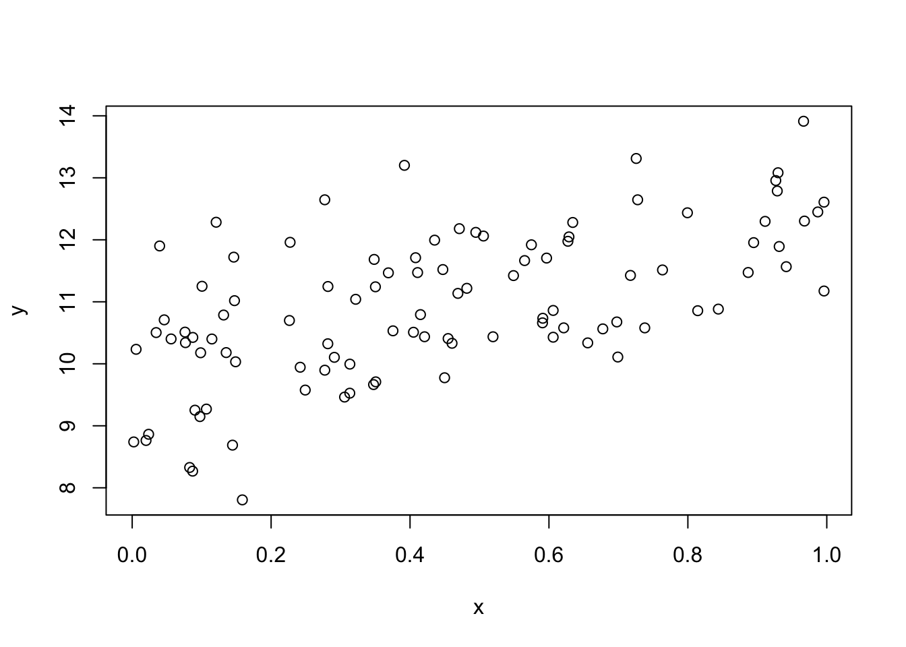
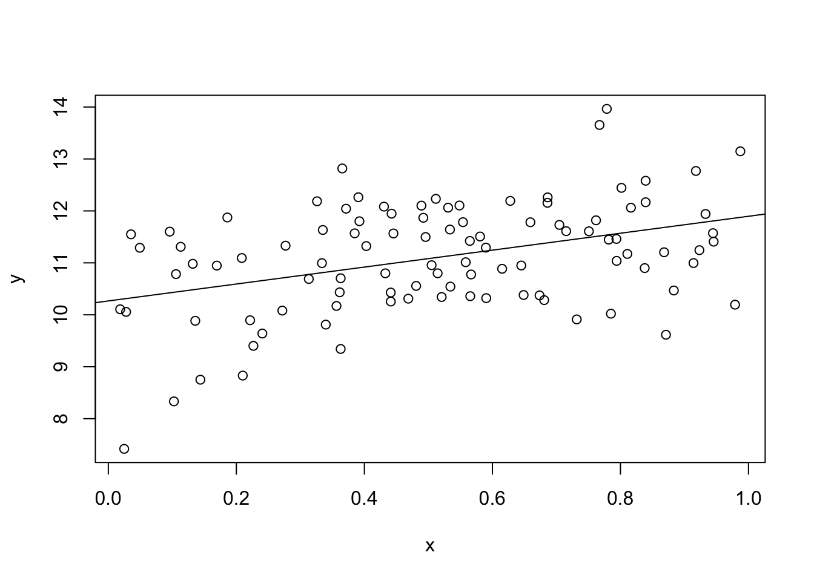
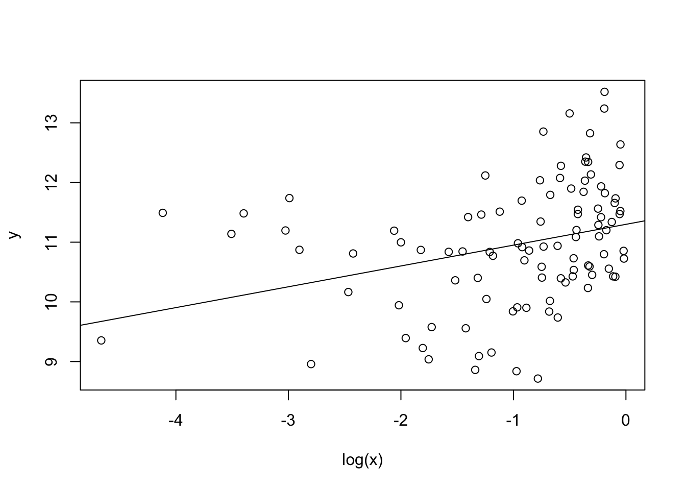
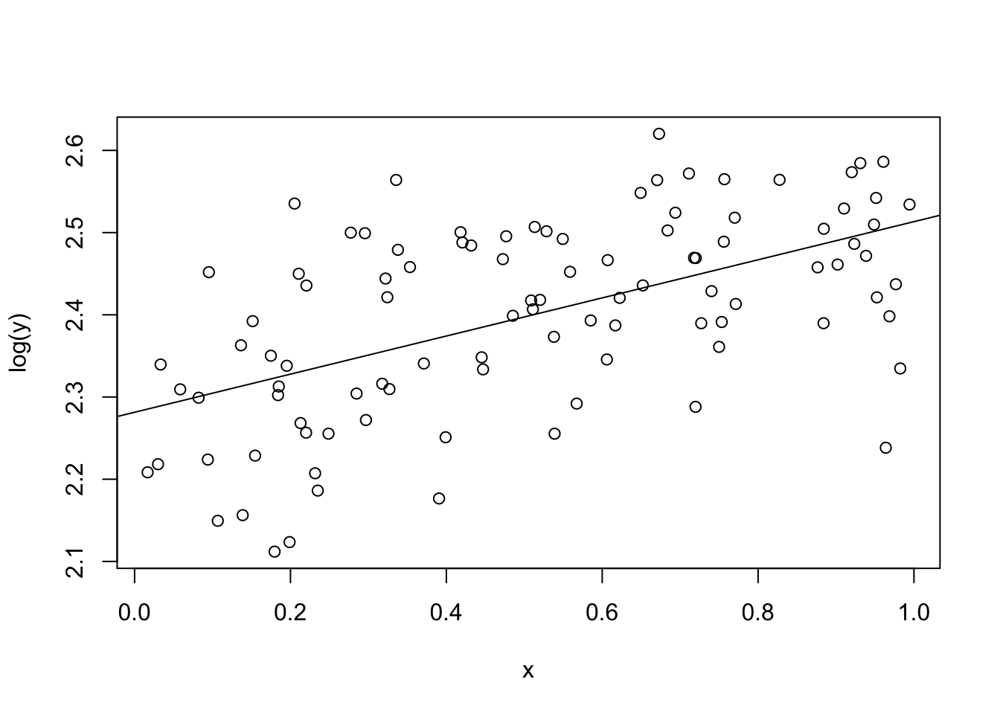
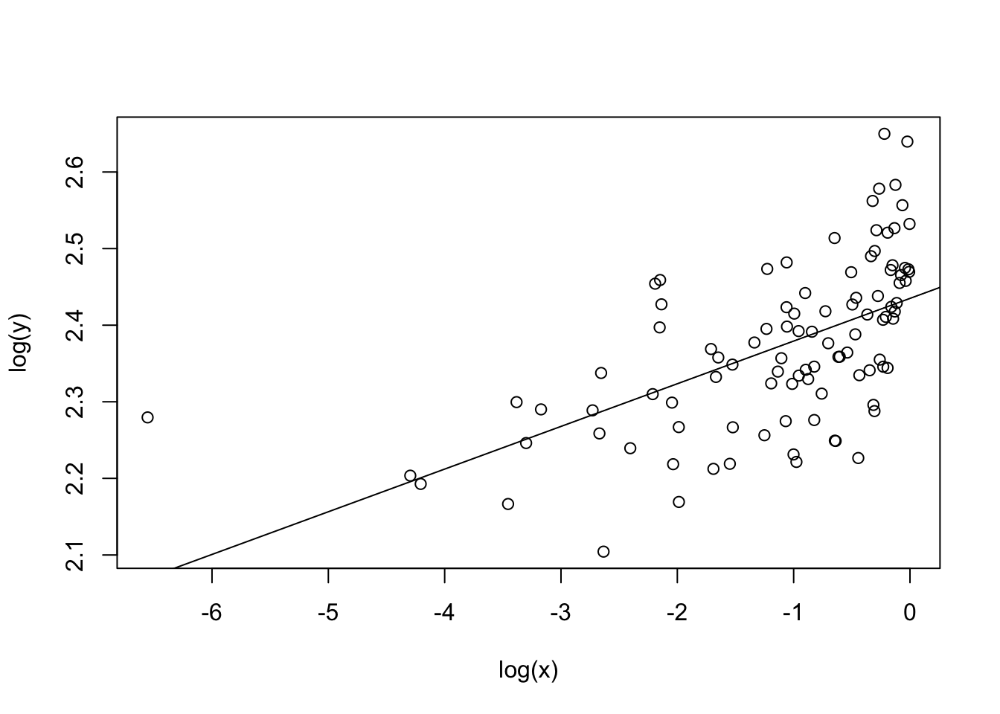

# 古典的仮定のもとでの最小二乗法


```r
library(AER)
```


## 単回帰モデル
次の単回帰モデルを考える.

$$
y = \alpha + \beta x + u
$$
ここで $x$ は説明変数で,  $y$ は被説明変数である. $u$ は誤差項である.
パラメータとして $\alpha$ は切片パラメータ, $\beta$ は傾きパラメータである.


次の仮定を置いている.

+ $(x_i,y_i)$ は独立同一分布にしたがう.
+ $E[u_i]=0$ である.
+ $u_i$ と $x_i$ は独立である.
+ $u_i$ は正規分布にしたがう.

このとき最小二乗推定量は一致で, 不偏であり, 正規分布にしたがう.
一致とは推定量が観測値を増やすことによって真のパラメータに (確率) 収束することある.
不偏とは推定量の期待値が真のパラメータになることである.
また他の線形不偏推定量のなかで最も分散が小さいことも知られている.


仮想的に以下のモデルを考える.

```r
N <- 100
x <- runif(N)
y <- 10 + 2*x + rnorm(N)
df <- data.frame(x,y)
```
作図すると以下である.

```r
plot(y~x)
```



R で回帰分析を実施するには `lm` を実施する.

```r
fm <- lm(y ~ x, data=df)
```

`fm` 自体はリストであり, 以下の要素がある.

```r
typeof(fm)
## [1] "list"
names(fm)
##  [1] "coefficients"  "residuals"     "effects"       "rank"         
##  [5] "fitted.values" "assign"        "qr"            "df.residual"  
##  [9] "xlevels"       "call"          "terms"         "model"
```

係数は次のコマンドを実施する.

```r
coef(fm)
## (Intercept)           x 
##   10.231143    1.722827
# coefficients(fm)
```

傾きの推定値は以下でも実行可能である.

```r
with(df, cov(x,y)/var(x))
## [1] 1.722827
```


作図すると以下のようになる.

```r
plot(y~x,data=df)
abline(fm)
```



残差は次のコマンドを実施する.

```r
head(resid(fm))
##          1          2          3          4          5          6 
##  0.2182708 -0.7307655 -1.4516485  0.9199156  0.9081529 -1.4437570
# residuals(fm)
# with(fm, residuals)
```

予測値は次のコマンドを実施する.

```r
head(fitted(fm))
##        1        2        3        4        5        6 
## 10.34930 11.08466 11.36921 10.47576 10.69256 10.73087
# fitted.values(fm)
# with(fm, fitted.values)
```
予測値の平均は被説明変数の平均と等しい．

```r
mean(fitted(fm))
## [1] 11.17207
mean(df$y)
## [1] 11.17207
```


残差自乗和は次のコマンドを実施する.

```r
deviance(fm)
## [1] 96.07181
sum(resid(fm)^2)
## [1] 96.07181
```

残差自乗和は残差変動とも呼ばれる．予測値の偏差の自乗和を回帰変動といい，被説明変数の自乗和を全変動といえば，全変動は回帰変動と残差変動に分解できる．

```r
sum((df$y-mean(df$y))^2)
## [1] 117.6275
sum((fitted(fm)-mean(df$y))^2)+deviance(fm)
## [1] 117.6275
```


### ティー検定
その結果を見るには `summary` を実施する.

```r
summary(fm)
## 
## Call:
## lm(formula = y ~ x, data = df)
## 
## Residuals:
##     Min      1Q  Median      3Q     Max 
## -2.0485 -0.6842  0.0920  0.5687  3.2518 
## 
## Coefficients:
##             Estimate Std. Error t value Pr(>|t|)    
## (Intercept)  10.2311     0.2238  45.724  < 2e-16 ***
## x             1.7228     0.3674   4.689 8.88e-06 ***
## ---
## Signif. codes:  0 '***' 0.001 '**' 0.01 '*' 0.05 '.' 0.1 ' ' 1
## 
## Residual standard error: 0.9901 on 98 degrees of freedom
## Multiple R-squared:  0.1833,	Adjusted R-squared:  0.1749 
## F-statistic: 21.99 on 1 and 98 DF,  p-value: 8.879e-06
```

これをみれば各変数の係数がゼロのティー検定の結果が示されている.
他にも, 残差標準誤差, 決定係数, 修正済み決定係数, 全ての係数がゼロであるエフ検定の結果も示されている.

`summary(fm)` もリストであり, それぞれの要素は以下である.

```r
typeof(summary(fm))
## [1] "list"
names(summary(fm))
##  [1] "call"          "terms"         "residuals"     "coefficients" 
##  [5] "aliased"       "sigma"         "df"            "r.squared"    
##  [9] "adj.r.squared" "fstatistic"    "cov.unscaled"
```

単なる `fm` と同じ名前もあるが, 中身が違っている場合もある.
例えば `residuals` は同じであるが, 係数はより情報が加わっている.

```r
coef(summary(fm))
##              Estimate Std. Error   t value     Pr(>|t|)
## (Intercept) 10.231143  0.2237588 45.723979 6.547686e-68
## x            1.722827  0.3674058  4.689166 8.879190e-06
# coefficients(summary(fm))
```

残差の標準誤差は次のようにして得られる.

```r
with(summary(fm),sigma)
## [1] 0.9901134
sqrt(deviance(fm)/df.residual(fm))
## [1] 0.9901134
```

決定係数は次のようにして計算する.

```r
with(summary(fm),r.squared)
## [1] 0.1832535
1-deviance(fm)/with(df, sum((y-mean(y))^2))
## [1] 0.1832535
```

調整済み決定係数は次のようにして計算する.

```r
with(summary(fm),adj.r.squared)
## [1] 0.1749194
1-(deviance(fm)/df.residual(fm))/with(df, sum((y-mean(y))^2/(nrow(df)-1)))
## [1] 0.1749194
```


### 対数変換
次のモデルを考える.
$$
y = \alpha + \beta \log(x) + u
$$

対数変換をおこなう場合, `log` を用いるとよい.

```r
fm <- lm(y~log(x),data=df)
summary(fm)
## 
## Call:
## lm(formula = y ~ log(x), data = df)
## 
## Residuals:
##     Min      1Q  Median      3Q     Max 
## -1.9114 -0.6311  0.0334  0.5513  3.5361 
## 
## Coefficients:
##             Estimate Std. Error t value Pr(>|t|)    
## (Intercept)  11.6004     0.1397  83.012  < 2e-16 ***
## log(x)        0.5211     0.1186   4.395 2.82e-05 ***
## ---
## Signif. codes:  0 '***' 0.001 '**' 0.01 '*' 0.05 '.' 0.1 ' ' 1
## 
## Residual standard error: 1.001 on 98 degrees of freedom
## Multiple R-squared:  0.1646,	Adjusted R-squared:  0.1561 
## F-statistic: 19.31 on 1 and 98 DF,  p-value: 2.815e-05
```

作図すると以下のようになる.

```r
plot(y~log(x),data=df)
abline(fm)
```



被説明変数が対数の場合も同様である.

```r
fm <- lm(log(y)~x,data=df)
summary(fm)
## 
## Call:
## lm(formula = log(y) ~ x, data = df)
## 
## Residuals:
##      Min       1Q   Median       3Q      Max 
## -0.18444 -0.05620  0.01094  0.05363  0.24694 
## 
## Coefficients:
##             Estimate Std. Error t value Pr(>|t|)    
## (Intercept)  2.32692    0.01981  117.48  < 2e-16 ***
## x            0.14992    0.03252    4.61 1.22e-05 ***
## ---
## Signif. codes:  0 '***' 0.001 '**' 0.01 '*' 0.05 '.' 0.1 ' ' 1
## 
## Residual standard error: 0.08764 on 98 degrees of freedom
## Multiple R-squared:  0.1782,	Adjusted R-squared:  0.1698 
## F-statistic: 21.25 on 1 and 98 DF,  p-value: 1.216e-05
```

作図すると以下のようになる.

```r
plot(log(y)~x,data=df)
abline(fm)
```




被説明変数および説明変数が対数の場合以下である.

```r
fm <- lm(log(y)~log(x),data=df)
summary(fm)
## 
## Call:
## lm(formula = log(y) ~ log(x), data = df)
## 
## Residuals:
##       Min        1Q    Median        3Q       Max 
## -0.179627 -0.054632  0.007007  0.053338  0.270348 
## 
## Coefficients:
##             Estimate Std. Error t value Pr(>|t|)    
## (Intercept)  2.44752    0.01227 199.447  < 2e-16 ***
## log(x)       0.04711    0.01041   4.524 1.71e-05 ***
## ---
## Signif. codes:  0 '***' 0.001 '**' 0.01 '*' 0.05 '.' 0.1 ' ' 1
## 
## Residual standard error: 0.08793 on 98 degrees of freedom
## Multiple R-squared:  0.1727,	Adjusted R-squared:  0.1643 
## F-statistic: 20.46 on 1 and 98 DF,  p-value: 1.707e-05
```

作図すると以下のようになる.

```r
plot(log(y)~log(x),data=df)
abline(fm)
```




### 切片なし回帰モデル
次のモデルを考える.
$$
y = \beta x + u
$$

切片なしモデルを推定したい場合は次のように `-1` とする.

```r
fm <- lm(y~x-1,data=df)
summary(fm)
## 
## Call:
## lm(formula = y ~ x - 1, data = df)
## 
## Residuals:
##    Min     1Q Median     3Q    Max 
## -6.458 -1.532  1.684  4.914  9.956 
## 
## Coefficients:
##   Estimate Std. Error t value Pr(>|t|)    
## x  16.7879     0.7644   21.96   <2e-16 ***
## ---
## Signif. codes:  0 '***' 0.001 '**' 0.01 '*' 0.05 '.' 0.1 ' ' 1
## 
## Residual standard error: 4.655 on 99 degrees of freedom
## Multiple R-squared:  0.8297,	Adjusted R-squared:  0.828 
## F-statistic: 482.3 on 1 and 99 DF,  p-value: < 2.2e-16
```

もしくは `+0` を加える.

```r
fm <- lm(y~x+0,data=df)
summary(fm)
## 
## Call:
## lm(formula = y ~ x + 0, data = df)
## 
## Residuals:
##    Min     1Q Median     3Q    Max 
## -6.458 -1.532  1.684  4.914  9.956 
## 
## Coefficients:
##   Estimate Std. Error t value Pr(>|t|)    
## x  16.7879     0.7644   21.96   <2e-16 ***
## ---
## Signif. codes:  0 '***' 0.001 '**' 0.01 '*' 0.05 '.' 0.1 ' ' 1
## 
## Residual standard error: 4.655 on 99 degrees of freedom
## Multiple R-squared:  0.8297,	Adjusted R-squared:  0.828 
## F-statistic: 482.3 on 1 and 99 DF,  p-value: < 2.2e-16
```


## 重回帰モデル

説明変数として $w$ を加えたモデルを考える.
$$
y = \alpha + \beta x +\gamma w+ u
$$

暗黙に次の仮定を置いている.

+ $(w_i, x_i,y_i)$ は独立同一分布にしたがう.
+ 誤差項の期待値はゼロである. $E[u_i]=0$ である.
+ 誤差項 $u_i$ は説明変数 $(x_i, w_i)$ に対して独立である.
+ 誤差項 $u_i$ は正規分布にしたがう.
+ 説明変数間に多重共線性は存在しない. つまり $x_i$ は $w_i$ の一次変換で表せない.


仮想的に以下のモデルを考える.

```r
N <- 100
x<-runif(N)
w<-sample(c("H","T"),N,replace=TRUE)
y <- 10 + 2*x + ifelse(w=="H",1,0) + rnorm(N)
df <- data.frame(w,x,y)
```

説明変数を加えたいときには `+` と変数名を使うことができる. 

```r
fm <- lm(y~x+w,data=df)
summary(fm)
## 
## Call:
## lm(formula = y ~ x + w, data = df)
## 
## Residuals:
##     Min      1Q  Median      3Q     Max 
## -3.2689 -0.6318 -0.0323  0.6661  2.3643 
## 
## Coefficients:
##             Estimate Std. Error t value Pr(>|t|)    
## (Intercept)  11.5212     0.2322  49.626  < 2e-16 ***
## x             1.5231     0.3456   4.408 2.70e-05 ***
## wT           -1.2851     0.2048  -6.274 9.82e-09 ***
## ---
## Signif. codes:  0 '***' 0.001 '**' 0.01 '*' 0.05 '.' 0.1 ' ' 1
## 
## Residual standard error: 1.022 on 97 degrees of freedom
## Multiple R-squared:  0.3851,	Adjusted R-squared:  0.3724 
## F-statistic: 30.37 on 2 and 97 DF,  p-value: 5.735e-11
```

R の特徴は因子もとくに変換することなくダミー変数として扱える.

### 自乗項
説明変数として自乗項を加えたモデルを考える.
$$
y = \alpha + \beta x + \gamma x^2 + u
$$

R では単に自乗するのでなく `I(x^2)` としなければならない.

```r
fm <- lm(y~x+I(x^2),data=df)
summary(fm)
## 
## Call:
## lm(formula = y ~ x + I(x^2), data = df)
## 
## Residuals:
##     Min      1Q  Median      3Q     Max 
## -2.9113 -0.7644 -0.1635  0.7618  2.9608 
## 
## Coefficients:
##             Estimate Std. Error t value Pr(>|t|)    
## (Intercept) 10.89577    0.37793  28.830   <2e-16 ***
## x            1.49650    1.71605   0.872    0.385    
## I(x^2)       0.09733    1.62159   0.060    0.952    
## ---
## Signif. codes:  0 '***' 0.001 '**' 0.01 '*' 0.05 '.' 0.1 ' ' 1
## 
## Residual standard error: 1.211 on 97 degrees of freedom
## Multiple R-squared:  0.1355,	Adjusted R-squared:  0.1177 
## F-statistic: 7.603 on 2 and 97 DF,  p-value: 0.0008567
```

### 交差項
説明変数として交差項を加えたモデルを考える.
$$
y = \alpha + \beta x + \gamma w + \delta xw + u
$$

説明変数 `x` と `w`の自乗項は自乗項は `x:w` である.

```r
fm<-lm(y~x+w+x:w,data=df)
summary(fm)
## 
## Call:
## lm(formula = y ~ x + w + x:w, data = df)
## 
## Residuals:
##     Min      1Q  Median      3Q     Max 
## -3.2644 -0.6309 -0.0332  0.6697  2.3664 
## 
## Coefficients:
##             Estimate Std. Error t value Pr(>|t|)    
## (Intercept) 11.52819    0.29164  39.529  < 2e-16 ***
## x            1.51001    0.47693   3.166  0.00207 ** 
## wT          -1.29967    0.41913  -3.101  0.00253 ** 
## x:wT         0.02786    0.69599   0.040  0.96815    
## ---
## Signif. codes:  0 '***' 0.001 '**' 0.01 '*' 0.05 '.' 0.1 ' ' 1
## 
## Residual standard error: 1.027 on 96 degrees of freedom
## Multiple R-squared:  0.3851,	Adjusted R-squared:  0.3658 
## F-statistic: 20.04 on 3 and 96 DF,  p-value: 3.63e-10
```

もしくは以下のように `*` を使って簡便的に表せる.

```r
fm <- lm(y~x*w,data=df)
summary(fm)
## 
## Call:
## lm(formula = y ~ x * w, data = df)
## 
## Residuals:
##     Min      1Q  Median      3Q     Max 
## -3.2644 -0.6309 -0.0332  0.6697  2.3664 
## 
## Coefficients:
##             Estimate Std. Error t value Pr(>|t|)    
## (Intercept) 11.52819    0.29164  39.529  < 2e-16 ***
## x            1.51001    0.47693   3.166  0.00207 ** 
## wT          -1.29967    0.41913  -3.101  0.00253 ** 
## x:wT         0.02786    0.69599   0.040  0.96815    
## ---
## Signif. codes:  0 '***' 0.001 '**' 0.01 '*' 0.05 '.' 0.1 ' ' 1
## 
## Residual standard error: 1.027 on 96 degrees of freedom
## Multiple R-squared:  0.3851,	Adjusted R-squared:  0.3658 
## F-statistic: 20.04 on 3 and 96 DF,  p-value: 3.63e-10
```

### エフ検定
今, 帰無仮説が
$$
y = \alpha + \beta x + u
$$
で, 対立仮説が
$$
y = \alpha + \beta x + \gamma w + \delta xw + u
$$
となる検定を実施したい. 

これは複数の係数がゼロであるエフ検定である.
対立仮説の残差自乗和を $SSR$ とし, その自由度を $df$ とする.
自由度は観測数から説明変数の数を減じた数である.
帰無仮説の残差自乗和を $SSR_0$ とし, 制約の数を $q$ とする.
制約の数は帰無仮説の自由度から帰無仮説の自由度を差し引いた数である.
このとき, 以下のF値は帰無仮説が正しいもと自由度 $df$ と $q$ のF分布にしたがう.
$$
\frac{(SSR_0-SSR)/q}{SSR/df}
$$

R でF値は次のようにして算出する.

```r
fm0 <- lm(y~x,data=df)
fm1 <- lm(y~x*w,data=df)
dof <- fm1$df
q <- fm0$df-dof
SSR0 <- deviance(fm0)
SSR <- deviance(fm1)
(F <- ((SSR0-SSR)/q)/(SSR/dof))
## [1] 19.48192
```

この時のP値は以下である.

```r
1-pf(F,df1=q,df2=dof)
## [1] 7.917386e-08
```

これらの手順はコマンド `anova` を用いれば簡単に実現できる.

```r
anova(fm0,fm1)
## Analysis of Variance Table
## 
## Model 1: y ~ x
## Model 2: y ~ x * w
##   Res.Df    RSS Df Sum of Sq      F    Pr(>F)    
## 1     98 142.33                                  
## 2     96 101.24  2     41.09 19.482 7.917e-08 ***
## ---
## Signif. codes:  0 '***' 0.001 '**' 0.01 '*' 0.05 '.' 0.1 ' ' 1
```

順番を変えても, 検定統計量自体に変更はない.

```r
anova(fm1,fm0)
## Analysis of Variance Table
## 
## Model 1: y ~ x * w
## Model 2: y ~ x
##   Res.Df    RSS Df Sum of Sq      F    Pr(>F)    
## 1     96 101.24                                  
## 2     98 142.33 -2    -41.09 19.482 7.917e-08 ***
## ---
## Signif. codes:  0 '***' 0.001 '**' 0.01 '*' 0.05 '.' 0.1 ' ' 1
```

